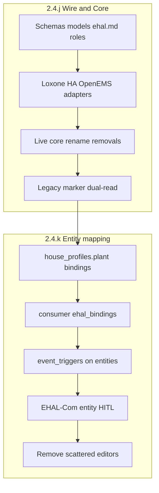

# Implement 2.4.j + 2.4.k (entity triggers)

## Locked decisions

- **Order:** j → k; Live must stay runnable after j on today’s marker config (dual-read).
- **Wire:** §C names are canonical (`sens_*` / `set_*` / `get_*`). Bump EHAL wire `schema_version` **1 → 2**; adapters emit only §C names. During j, **config** still resolves legacy `loxone_blocks` / `charging_schedule.loxone.*_name` / HA map aliases (unprefixed → `sens_*`).
- **Storage (k):** No new per-entity files. Bindings live on existing records in [`house_profiles.json`](share/config/house_profiles.schema.json):
  - **Plant entity** (new top-level object, e.g. `plant`): grid/PV/ESS/house-load bindings + **house-wide event triggers**
  - **Consumers:** `ehal_bindings: { <ehal_field>: <backend_address> }` for EV/flex/thermal; entity-scoped triggers when the watched signal belongs to that consumer
- **Triggers:** Remove `system.event_triggers` from [`config.json`](share/config/config.schema.json). Each trigger references an EHAL field on the same entity (backend address from `ehal_bindings`); keep `id`, `signal_type`, `on_change`, `label`. Aggregate at runtime via a loader (replace `load_event_triggers` / `config.get_event_triggers()`).
- **Out of gate:** [`2.4.l`](backlog/Backlog.md) EFM auto-sync; HA stays plant-flat in `ehal.ha.entities` (keys renamed to §C) unless a later chapter entity-scopes HA.

---

## Phase A — 2.4.j: Schemas / spec / roles

**Touch:** [`share/ehal/telemetry.schema.json`](share/ehal/telemetry.schema.json), [`share/ehal/setpoint.schema.json`](share/ehal/setpoint.schema.json), [`share/ehal/capabilities.schema.json`](share/ehal/capabilities.schema.json), [`share/ehal/roles/*`](share/ehal/roles/), [`ehal/models.py`](ehal/models.py), [`docs/spec/ehal.md`](docs/spec/ehal.md), [`docs/ui/ehal-com.md`](docs/ui/ehal-com.md) §B (already largely aligned).

- Rename telemetry: `grid_power_active` → `sens_grid_power_active`, etc.; add `sens_power_consumers`, EV `sens_evcs_*`.
- Extend setpoints: `set_ess_mode`, `set_evcs_current`, `set_evcs_mode` (`pv`|`now`); keep existing ESS limits + `set_evcs_max_current`.
- Add inputs: `get_evcs_ready_by_time`, `get_evcs_limit_soc` (document in roles/EVCS; may live on extended telemetry/input doc or EVCS role fields used by mapping — not necessarily every poll envelope).
- Unfreeze former “out of scope” extras in `ehal.md` that §C promotes; leave flex as stub ids (`flex.*`).
- Update contract tests: [`tests/test_ehal.py`](tests/test_ehal.py), [`tests/test_ehal_contract_backends.py`](tests/test_ehal_contract_backends.py), [`tests/test_ehal_profiles.py`](tests/test_ehal_profiles.py).

## Phase B — 2.4.j: Adapters + live façade

**Touch:** [`integrations/loxone_adapter.py`](integrations/loxone_adapter.py), [`integrations/ha_adapter.py`](integrations/ha_adapter.py), [`integrations/openems_adapter.py`](integrations/openems_adapter.py), [`integrations/ehal_live.py`](integrations/ehal_live.py), [`integrations/loxone_ehal_mapping.py`](integrations/loxone_ehal_mapping.py) (`EHAL_TO_BLOCKS` → §C keys), [`ui/ehal_ha_mapping.py`](ui/ehal_ha_mapping.py).

- Emit/consume §C names only on the wire.
- Dual-resolve plant markers from legacy `loxone_blocks` keys via updated `EHAL_TO_BLOCKS`.
- HA: read `ehal.ha.entities` with alias (old unprefixed key → new `sens_*`); write new keys on next save.
- `sens_power_consumers`: if marker present use it; else derive house load from grid/PV/ESS balance (document in C.1 — already sketched).
- Loxone: implement write semantics for `set_evcs_max_current` / `set_evcs_current` / `set_evcs_mode` / `set_ess_mode` on transitional bindings; flip `supports_evcs_current` when the path works (today hardcoded `False`).

## Phase C — 2.4.j: Core removals / renames / internal calc

**Hot paths:**

| Change | Primary files |
|--------|----------------|
| PV counter → ∫ `sens_pv_production_active` × Δt → `pv_kwh_interval` | [`data/pv_tuner.py`](data/pv_tuner.py), [`main.py`](main.py) |
| Drop ESS `target_soc_name` write | [`integrations/loxone_client.py`](integrations/loxone_client.py) Huawei path |
| `control_cmd_name` → `set_ess_mode` | same + adapter write |
| Drop `soc_at_plug_in_name` | [`optimizer/charging_session.py`](optimizer/charging_session.py), [`optimizer/charging_context.py`](optimizer/charging_context.py) |
| Internal Sofortladen remaining time | [`optimizer/charge_immediate.py`](optimizer/charge_immediate.py) (energy-to-target / power; stop reading countdown Merker) |
| `nominal_power_kw_name` → `sens_evcs_nominal_current` + V/phases → kW | [`integrations/loxone_client.py`](integrations/loxone_client.py), live override in `main.py` |
| `power_setpoint_name` → `set_evcs_current` (A) | [`optimizer/consumer_power.py`](optimizer/consumer_power.py), flex write path |
| `pv_follow_name` + `charge_immediate_name` → `set_evcs_mode` | charge_immediate + consumer_power + writes |
| Promote EV reads to EHAL names (dual-read legacy) | charging_context, ev_soc_tracking, loaders |

Flex stubs stay `flex.*` (no rename). Marker **editors** unchanged in j.

**Acceptance (j):** Core + adapters speak §C; Live green on legacy marker config; contract tests green; no editor removal yet.

---

## Phase D — 2.4.k: Entity binding model + trigger migration

**Schema / store:**

- Extend [`share/config/house_profiles.schema.json`](share/config/house_profiles.schema.json):
  - `plant.ehal_bindings` (map §C field → backend address string)
  - `plant.event_triggers[]` (id, ehal_field, signal_type, on_change, label)
  - per-consumer `ehal_bindings` + optional `event_triggers[]`
- One-shot / on-load migrator:
  - `loxone_blocks` → `plant.ehal_bindings` (via §C field names)
  - `system.event_triggers` → `plant.event_triggers` (map `loxone_name` into binding for watched field or store address under a trigger-specific EHAL stub field if no existing field; prefer attaching EV plug triggers to the EV consumer when id/heuristic matches)
  - nested `charging_schedule.loxone.*` / `loxone_inputs` / `loxone_outputs` / thermal → consumer `ehal_bindings`
- Replace [`settings/system_settings.py`](settings/system_settings.py) `load_event_triggers` with house-profile aggregation; stop writing `system.event_triggers`; remove from config schema + examples.
- Dual-read until migration confirmed, then drop legacy keys from live path.

**Runtime consumers:** [`optimizer/event_trigger.py`](optimizer/event_trigger.py), [`main.py`](main.py), [`integrations/loxone_connectivity.py`](integrations/loxone_connectivity.py), [`settings/config_loaders.py`](settings/config_loaders.py) — all use aggregated entity triggers.

## Phase E — 2.4.k: EHAL-Com UI + remove scattered editors

**Replace / extend:**

- [`ui/ehal_loxone_mapping.py`](ui/ehal_loxone_mapping.py): HITL maps `{entity}.{ehal_field}` → Merker; reuse [`integrations/loxone_structure.py`](integrations/loxone_structure.py) scan + propose; **save into plant/consumer `ehal_bindings`**, not flat `loxone_blocks`.
- Entity list = plant + SK/live-scenario consumers (same shape as Earnie entities).
- Include C.4 `flex.*` and trigger rows in the same mapping model; complete TO BE IMPLEMENTED cells (`set_evcs_max_current`, `get_evcs_limit_soc`, optional `sens_power_consumers` Merker).

**Remove editors:**

- [`ui/loxone_marker_forms.py`](ui/loxone_marker_forms.py) Anlagen-Merker + event-trigger list on EHAL-Com
- Hauskonfigurator Smarthome-Merker expanders in [`ui/house_config_profile_form.py`](ui/house_config_profile_form.py) / [`ui/smarthome_marker_fields.py`](ui/smarthome_marker_fields.py) (bindings only via EHAL-Com)
- End dual-read of `loxone_blocks` + nested `*_name` when migration done

**Docs (German user docs):** [`docs/ui/ehal-com.md`](docs/ui/ehal-com.md), [`docs/referenz/loxone-signale.md`](docs/referenz/loxone-signale.md) — entity-centric mapping + triggers on entities; no `system.event_triggers`.

**Acceptance (k):** No scattered `*_name` editors; no triggers in `config.json`; Loxone Live on EHAL-keyed plant/consumer bindings; running system.

---

## Test strategy (both chapters)

- Extend EHAL contract suite after each phase (schema + 3 backends).
- Migrator unit tests: blocks + nested `*_name` + `event_triggers` → entity bindings; reverse dual-read.
- Charge-immediate / PV integral / EV current+mode behavior tests (replace Merker-countdown and counter fixtures).
- UI-adjacent: mapping save writes `plant`/`consumer` bindings; config round-trip no longer persists `system.event_triggers` / `loxone_blocks` after cutover.

## Suggested implementation slices (commit-sized)

1. Schemas + models + ehal.md + roles + tests (j wire freeze)
2. Adapters + ehal_live + HA alias + Loxone dual-read plant
3. PV integral + ESS/EV removals + mode/current/set_ess_mode
4. Contract + live path green (j acceptance)
5. house_profiles plant + ehal_bindings schema + migrator + trigger aggregation
6. EHAL-Com entity HITL save path; drop marker/trigger editors; docs
7. End dual-read; k acceptance
