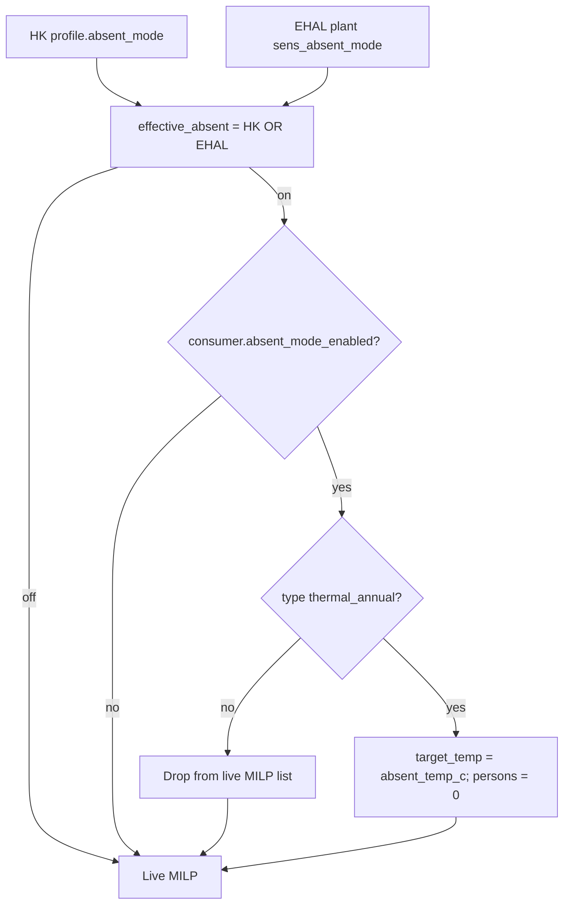

# Absent / holiday mode (live-only)

## Decisions (locked)

- **Activation (OR):** `profile.absent_mode` (HK) **or** live plant EHAL `sens_absent_mode == true` → effective absent ON. Unmapped/unreadable EHAL does not force OFF. HK remains a force-on switch even when EHAL is bound (turning HK off does **not** clear absent if EHAL still reports true).
- **HK status display (when EHAL binding exists):** next to the master switch, show (1) live EHAL value (`sens_absent_mode`: an / aus / nicht lesbar / nicht gebunden) and (2) **effective** absent state (finally aktiv / inaktiv = HK ∨ EHAL). Caption: Smarthome can keep absent ON while the Earnie switch is off.
- **Non–Haus-Wärme (opt-in):** for that **live run**, drop the consumer from the flex list used for optimization — so **no daily target, no MILP variables/schedule, no planned flex delivery** for them. Does **not** force Loxone/HA actuators off. SE/backtesting unchanged. (“Daily targets only” was misleading shorthand; targets are just the first step that disappears when the consumer is omitted from the live flex list.)
- **Haus-Wärme (`thermal_annual`, opt-in):** stay in live MILP; use `absent_temp_c` instead of `target_temp_c`; set **`persons = 0`** (warm water → 0 via existing `warm_water_kwh_week`).
- **Scope:** live optimization path only (`main.py` / live consumer+target resolution). Do **not** apply in `scenario_resolution` / SE / planning overlays.



## Data model

| Layer | Field | Default |
|-------|-------|---------|
| House profile | `absent_mode: bool` | `false` |
| Each consumer | `absent_mode_enabled: bool` | `false` |
| `thermal_annual` → `thermal` | `absent_temp_c: number` | e.g. `15.0` (normalize in [`profiles_store.py`](house_config/profiles_store.py) next to `target_temp_c`) |
| Plant EHAL | `sens_absent_mode` → Merker/entity | optional |

Update [`share/config/house_profiles.schema.json`](share/config/house_profiles.schema.json) (+ example if useful). Preserve new keys through HK save/passthrough (`_PASSTHROUGH_CONSUMER_KEYS` / normalize).

## Core runtime helper

Add a small module (e.g. [`optimizer/absent_mode.py`](optimizer/absent_mode.py) or [`house_config/absent_mode.py`](house_config/absent_mode.py)):

1. `read_ehal_absent_mode(house_doc) -> bool | None` — `resolve_plant_binding(..., "sens_absent_mode")` + binary Merker read (same style as `sens_evcs_connected` / ambient plant reads). Return `None` if unbound/failed.
2. `effective_absent_mode(profile, ehal_live: bool | None) -> bool` — `bool(profile.absent_mode) or bool(ehal_live)`.
3. `apply_absent_mode_to_live_flex(consumers, profile, *, active: bool) -> list` — if not `active`, return consumers unchanged; else:
   - **thermal_annual** with opt-in: shallow-copy consumer/`thermal`, set `target_temp_c = absent_temp_c`, `persons = 0`; keep in list.
   - **other** with opt-in: omit from returned list (or set run-local `optimizer_enabled=False` before `optimizer_only` filter — prefer omit/clear so remaining-kWh / delivery skip them too).
4. Call **only** from the live path in [`main.py`](main.py) (around consumer load / before `resolve_consumer_daily_targets` / `prepare_optimization_matrix`), after house profile is available. Do not wire into SE `simulation/engine.py`.

Thermal daily targets already go through [`thermal_daily_kwh_for_date`](optimizer/thermal_flex_context.py) → `heating_params_from_thermal`; mutating the live consumer’s `thermal` before target resolve is enough (no SE climate path change).

## HK UI

- Master switch on Hausprofil tab (identity/location area in [`ui/house_config_profile_form.py`](ui/house_config_profile_form.py) / thermal location block): checkbox „Abwesend / Urlaub“ — always editable; persists `profile.absent_mode` only (does not write back to EHAL).
- **Status row under the switch** (best-effort live read via same helper as runtime; tolerate failure without blocking the form):
  - EHAL: unbound | nicht lesbar | an | aus
  - Wirksam (Live): **aktiv** | **inaktiv** (= HK ∨ EHAL)
  - Short caption that OR semantics apply when a plant binding is configured
- Per consumer in [`ui/house_config_profile_consumers.py`](ui/house_config_profile_consumers.py) (shell or type forms): checkbox „Bei Abwesenheit berücksichtigen“.
- Haus Wärme in [`ui/house_config_profile_thermal.py`](ui/house_config_profile_thermal.py): number input „Abwesenheits-Temperatur (°C)“ → `absent_temp_c` (show whenever type is `thermal_annual`; optional caption that it applies only when effective absent + opt-in are on).

Follow existing `labeled_checkbox` / scoped keys / `auto_persist` patterns ([streamlit-ui-state skill](.cursor/skills/streamlit-ui-state/SKILL.md)).

## Monitor page hint

On [`ui/pages/page_cockpit.py`](ui/pages/page_cockpit.py) (**Monitor**), directly under the page title: when **effective** absent is ON, show a compact top hint (e.g. `st.info`), e.g. „Abwesenheitsmodus aktiv“ — optionally note source briefly (Earnie / Smarthome / beide) without clutter. When effective is OFF, show nothing (no permanent banner). Reuse the same effective-absent helper as HK (best-effort EHAL read; fail soft).

## EHAL plant binding

Mirror `sens_temperature_outside` plant pattern:

- Add `sens_absent_mode` to plant field lists / DE labels: [`ui/ehal_loxone_mapping.py`](ui/ehal_loxone_mapping.py), [`ehal/profiles.py`](ehal/profiles.py), [`integrations/ehal_debug_mapping.py`](integrations/ehal_debug_mapping.py) (`PLANT_LIVE_READ_FIELDS`).
- Discovery hints in [`integrations/loxone_ehal_mapping.py`](integrations/loxone_ehal_mapping.py) (e.g. urlaub, abwesend, holiday, absent) for EHAL-Com heuristic propose.
- Docs (German user / referenz): [`docs/ui/ehal-com.md`](docs/ui/ehal-com.md), [`docs/referenz/loxone-signals.md`](docs/referenz/loxone-signals.md); short HK note in handbook / flexible-verbraucher if needed.
- Canonical Merker name: **`Earnie_Abwesend`**.
- HA mapping: add to plant entity map surface if plant optional fields are already listed there; no wire-schema bump required (same as ambient — not part of M1 `read_telemetry()` payload).

## Loxone VO template + greenfield auto-binding

Frozen contract: VO Cmd **Title** == `greenfield_device_map.name` == `plant.ehal_bindings[sens_absent_mode]`.

1. **VO template** — add boolean plant cmd to [`share/loxone/templates/VirtualOut/VO_Earnie_Plant.xml`](share/loxone/templates/VirtualOut/VO_Earnie_Plant.xml) (copy ambient shape; use `Analog="false"` like pool binary VOs):

```xml
<VirtualOutCmd Title="Earnie_Abwesend"
  Comment="sens_absent_mode 0/1"
  CmdOnMethod="GET"
  CmdOn="/ehal/loxone/telemetry/sens_absent_mode/\v"
  ... Analog="false" .../>
```

2. **Greenfield device map** — exact plant row in [`share/loxone/greenfield_device_map.json`](share/loxone/greenfield_device_map.json):

```json
{
  "name": "Earnie_Abwesend",
  "match": "exact",
  "entity_kind": "plant",
  "ehal_field": "sens_absent_mode",
  "notes": "House absent mode 0/1; Pattern B VO on Plant."
}
```

   Exact plant match already lands in `plant.ehal_bindings` via [`integrations/greenfield_match.py`](integrations/greenfield_match.py) (`entity_kind == "plant"` → `plant_bindings.setdefault`). No code change required there if the map row is present and the Merker exists on the Miniserver (LoxAPP3 / probe).

3. **Catalog docs** — list the new Title in [`share/loxone/templates/README.md`](share/loxone/templates/README.md) and signal tables above.

4. **Heuristic auto-propose** — extend `_HINTS` / optional telemetry lists so EHAL-Com scan can propose `Earnie_Abwesend` ↔ `sens_absent_mode` when the Default Merker is not used (parallel to greenfield exact match).

5. **Tests** — extend [`tests/test_loxone_greenfield_import.py`](tests/test_loxone_greenfield_import.py) (and fixture names if needed) so plant binding for `sens_absent_mode` → `Earnie_Abwesend` is asserted when the marker is present.

## Tests

- Unit: OR activation (HK only / EHAL only / both / neither / unbound).
- Unit: opt-in thermal → `target_temp_c` overridden + `persons==0`; non-thermal opt-in removed from live list; opt-out unchanged.
- Unit: helper no-op when `active=False`.
- Regression: SE/planning path does not call apply helper (or calling with inactive leaves consumers identical).
- Greenfield: plant auto-bind `Earnie_Abwesend` → `sens_absent_mode`.

## Out of scope (this item)

- Force-off of Loxone enable Merker / previous-plan actuators.
- Changing SE/backtesting holiday economics.
- Writing absent temperature to Loxone water setpoint.
