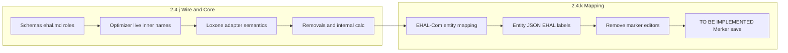

# Rewrite 2.4.j / 2.4.k for Loxone-ready EHAL path

## Verdict

- **Order stays j → k** (wire/core/adapters before mapping UI/storage).
- **Rescope bullets**, do not drop scope: everything currently listed in j/k remains somewhere in j+k; mapping/UI phrases move from j → k.
- **End state after both:** Live with `ehal.backend=loxone` runs on EHAL value names only; Loxone Merker bindings live only in entity-centric mapping (EHAL-Com), not scattered `*_name` editors.
- **Out of gate:** EFM auto-sync stays [`2.4.l`](backlog/Backlog.md) (fix stale `2.4.0` / ehal-com refs that still say `2.4.j` / `2.4.i`).

## Locked decisions

| Topic | Choice |
|-------|--------|
| `sens_power_consumers` | Prefer mapped Merker; else derive house load from grid/PV/ESS balance; document both in C.1 |
| Edit set now | [`backlog/Backlog.md`](backlog/Backlog.md) **and** [`docs/ui/ehal-com.md`](docs/ui/ehal-com.md) |
| Wire vocabulary | §C names are canonical (`sens_*` telemetry, `set_*` / `get_*` setpoints/inputs); §B updated to match in the same doc pass |
| `set_evcs_mode` | Single enum field (`pv` / `now`), not two wire fields |
| Nominal kW → A | Replace read marker with `sens_evcs_nominal_current` (A); power = f(A, `nominal_power_voltage_v`, `nominal_power_phases`) in core |
| j transitional | During 2.4.j, adapters may still resolve today’s `loxone_blocks` / house-profile `*_name` keys; **2.4.k** owns migration + editor removal |

## File changes (this task only — backlog/docs, not feature code)

### 1. Rewrite [`backlog/Backlog.md`](backlog/Backlog.md) — **2.4.j**

Title/subtitle: **EHAL wire & core semantics** (Loxone-specific names out of Earnie inner logic).

**Keep / clarify in j:**

- Remove / replace behaviors: `pv_counter_name` → integral of `sens_pv_production_active` × Δt → `cons_data` `pv_kwh_interval`; drop ESS `target_soc_name`; drop EV `soc_at_plug_in_name`; internal Sofortladen remaining time; nominal kW marker → `sens_evcs_nominal_current` + V/phases math
- Freeze wire: rename/extend telemetry to `sens_*`; add `sens_power_consumers` (Merker-or-derive); promote `set_ess_mode`, `set_evcs_current`, `set_evcs_mode`, `get_evcs_limit_soc`, `get_evcs_ready_by_time`, EV `sens_evcs_*` reads
- Update `share/ehal/*.schema.json`, `share/ehal/roles/*`, [`docs/spec/ehal.md`](docs/spec/ehal.md) (unfreeze former “out of scope” extras that C/j promote), adapters, contract tests
- Adapter write **semantics** for `set_evcs_max_current` / modes / current (capability flip when path works); transitional binding via existing config keys until k
- C.4: keep flex as stub EHAL ids (`flex.power_name`, `flex.enable_name`, `flex.power_setpoint_name`) — no rename in j; k maps them

**Move from j → k:**

- HITL / EHAL-Com grouping, house-profile / `loxone_blocks` marker editors, “+ Loxone Merker” user assignment, “update config/UI/docs” for marker paths, persist mapping in entity JSON

**Acceptance for j alone:** Core + adapters speak EHAL names; Live still runnable with **legacy** marker config (dual-read). Not yet “editors gone”.

### 2. Rewrite [`backlog/Backlog.md`](backlog/Backlog.md) — **2.4.k**

Title: **Entity-centric EHAL mapping** (bridging layer Earnie ↔ smarthome backend).

**Own in k (enlarged, nothing deferred):**

- Remove all marker-name editors (plant, EV `charging_schedule.loxone.*`, flex consumers, triggers)
- EHAL-Com maps `{entity}.{ehal_field}` → Loxone/HA/OpenEMS; structure = SK / live-scenario entities; reuse 2.4.f auto-propose
- Store bindings in entity JSON with EHAL value names as labels
- Complete C **TO BE IMPLEMENTED** cells via saved mapping (`set_evcs_max_current`, `get_evcs_limit_soc`, and any new Merker for `sens_power_consumers` when not deriving)
- Migrate off flat `loxone_blocks` / nested Loxone `*_name`; dual-read ends when migration done
- Event triggers + C.4 flex stubs included in the same mapping model (required for full Loxone house run)

**Acceptance after k:** No scattered `*_name` editors; Loxone Live uses only EHAL-keyed mapping; system runs.

### 3. Hygiene in same backlog edit

- **2.4.0** note: EFM auto-sync → **`2.4.l`** (not `2.4.j`)
- Fix markdown: close bold on 2.4.j title; fix `sens_*` wording; fix 2.4.k `@ehal_com.md` → `docs/ui/ehal-com.md`; “namess” typo

### 4. Align [`docs/ui/ehal-com.md`](docs/ui/ehal-com.md)

- Fix C.3: `get_evcs_ready_by_time`
- §B table: use §C `sens_*` / extended field names (or short note that §B = frozen post-2.4.j wire = §C)
- C.1 `sens_power_consumers`: replace `EXISTS ALREADY?` with Merker-or-derive rule
- C.3: add `sens_evcs_nominal_current`; normalize `set_evcs_mode` as one field with values `pv`/`now`; backtick `set_ess_mode`
- EFM sentence: backlog **`2.4.l`** (not `2.4.i`)
- Status casing: consistent `TO BE REMOVED` / `TO BE IMPLEMENTED` where still accurate after rewrite

**Not in this edit:** implementing schemas/adapters/UI code; [`docs/spec/ehal.md`](docs/spec/ehal.md) full rewrite (only referenced as a **2.4.j** implementation bullet). Optional one-line EFM id fix in `ehal.md` if touched for consistency — prefer leave to 2.4.j implementation unless a single-line ref fix is trivial in the same pass (skip unless already editing that file).

## Implementation order reminder (for later feature work)

1. Schemas + `ehal.md` + roles (= C.1–C.3 minus placeholders)  
2. Adapters + core rename  
3. Removals + internal computations  
4. Transitional legacy config read  
5. Then **k**: unified mapping, migration, drop editors, TO BE IMPLEMENTED Merker save  

No feature code in this task — only backlog + ehal-com consistency so implementation can start without re-planning.