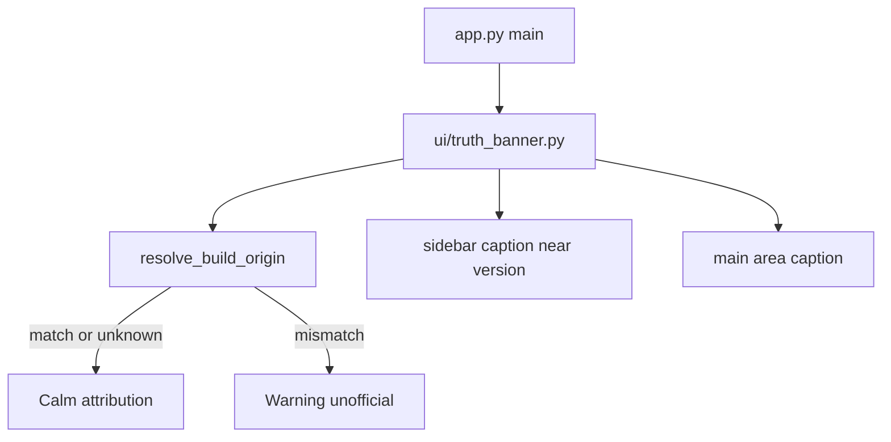

# Banner der Wahrheit — A + light B (Layer C later)

## Locked defaults (from prior discussion)

- **Audience:** Every build shows a calm attribution banner (name, non-commercial note, official repo, version). Only when origin looks unofficial → louder `st.warning` style (“Unofficial / modified build”).
- **Second UI site:** Main-area caption in [`app.py`](app.py) (runs before `navigation.run()`, so it appears on every page). Not `mode_selector` (that path is env-notice-only).
- **Official identity:** `https://github.com/JochenTCC/Earnie` (from [`README.md`](README.md)).
- **Scope honesty:** Document as *tamper-resistant, not tamper-proof*. No Cython, no startup kill switch, no phone-home in this chapter.
- **UI language:** German user-facing strings (chat/commits stay English).

## Layer A + light B — implement now

### 1. Canonical module [`ui/truth_banner.py`](ui/truth_banner.py)

- Constants: `OFFICIAL_REPO_URL = "https://github.com/JochenTCC/Earnie"`, required phrase fragments used by tests.
- `resolve_build_origin() -> str | None`:
  1. `EARNIE_BUILD_ORIGIN` / legacy `ENERGY_OPTIMIZER_BUILD_ORIGIN` via existing [`runtime_store/env_vars.py`](runtime_store/env_vars.py) `read_env("BUILD_ORIGIN")`
  2. Else best-effort `git remote get-url origin` (subprocess, short timeout; swallow failures → `None`)
- `is_unofficial_origin(origin: str | None) -> bool`: `False` if `None`/empty (Docker/SCC without git → calm banner, avoid false positives). `True` only when normalized origin clearly differs from official (normalize: strip `.git`, lowercase, accept `git@github.com:JochenTCC/Earnie` vs HTTPS).
- `render_truth_banner(*, where: Literal["sidebar", "main"])`:
  - Calm: Earnie · private non-commercial use · link · `Version {__version__}` (sidebar can fold version into this and replace `_render_sidebar_version` duplication).
  - Unofficial: same facts + warning that this is an unofficial/modified build; still show official URL.
- Keep helpers ≤40 LOC each; no Streamlit import inside origin resolution.

### 2. Wire into [`app.py`](app.py)

- Import `render_truth_banner`.
- Call **sidebar** near current `_render_sidebar_version()` (merge version into banner; remove redundant caption or make `_render_sidebar_version` a thin wrapper).
- Call **main** once before `navigation.run()` (light caption / compact markdown — not a large alert on official builds).
- Also call on the Loxone setup early-exit path (`needs_loxone_setup` → before `st.stop()`), sidebar at minimum, so first-run/SCC users still see attribution.

### 3. LICENSE touch ([`LICENSE.md`](LICENSE.md) §4)

Add one explicit sentence: public forks/distributions must keep the in-app attribution banner (Banner der Wahrheit) visible and unmodified in meaning (same idea as keeping the license text). No full license rewrite.

### 4. Short user-doc note (German)

One short subsection under license/branding in [`docs/user-manual/Benutzer-Handbuch-Earnie.md`](docs/user-manual/Benutzer-Handbuch-Earnie.md) (or a single cross-link from [`docs/README.md`](docs/README.md) if handbook already covers license): what the banner means; that unofficial builds may show a warning. Keep minimal.

### 5. Tests — [`tests/test_truth_banner.py`](tests/test_truth_banner.py)

- Required strings / `OFFICIAL_REPO_URL` present on module.
- `is_unofficial_origin`: official HTTPS and SSH forms → false; different repo → true; `None` → false.
- `app.py` source contains `render_truth_banner` (presence / import guard — light B).
- No Streamlit AppTest required for v1 unless cheap and already patterned nearby.

### 6. Backlog

After implementation: mark the 2.2.0 checkbox in [`backlog/Backlog.md`](backlog/Backlog.md) done and archive a short note in [`backlog/Backlog-Erledigt.md`](backlog/Backlog-Erledigt.md). Add a **deferred** bullet under `2.+1` (or Research) pointing at Layer C outline below — do not implement C now.

**Do not** change [`version.py`](version.py) unless you explicitly approve a bump.

---

## Layer C — outline only (later; not this PR)

Goal: enforcement for **official distribution**, not “source forks can’t delete a widget.”

| Piece | Intent |
|-------|--------|
| Signed release / GHCR attestation | Official images carry build id + signature |
| Startup verifier | Check signature or registry token; on failure refuse start **or** force indelible watermark path inside the sealed image |
| Hardware / one-time registry ([`backlog/Backlog.md`](backlog/Backlog.md) `2.+1`) | Bind entitlement to household hardware; pairs with commercial exceptions in LICENSE |
| Policy | Unofficial source builds = unsupported; no claim that forks still show the banner |
| Explicit non-goals | Compiling only the banner widget; killing private air-gapped official use without a clear offline attestation story |

Trigger to start C: real rebrand/SaaS abuse, or when hardware registry work begins — not as a prerequisite for finishing 2.2.0.

---

## Out of scope now

- Cython/Nuitka, app-hash kill switches, phone-home
- Changing non-commercial license economics
- Hiding the banner on “official-looking” builds (everyone sees calm attribution)
