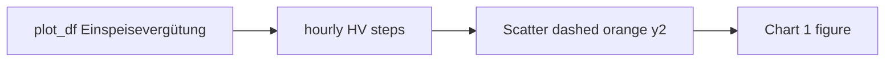

# Chart 1: Export tariff line (dashed orange)

## Scope

Backlog (`[backlog/Backlog.md](backlog/Backlog.md)` L44): add export tariff rates to Chart 1 as a dashed orange line in Cent/kWh.

**Axis decision:** Use **right axis `y2`** (same as import `Preis`), not the left power axis. Chart 1 left = Leistung (kW); right title is already `SoC (%) / Preis (Cent/kWh)`. The backlog’s “left y-axis” is treated as a wording slip relative to the live chart layout.

**Data:** No pipeline work. Column `Einspeisevergütung (Cent/kWh)` is already filled from `k_push_act` in MILP chart rows (`[optimizer/simulation.py](optimizer/simulation.py)` `_chart_price_fields`) and history (`[runtime_store/history_timeline.py](runtime_store/history_timeline.py)`).

## Implementation

1. **Generalize price helpers** in `[ui/chart_trace_segments.py](ui/chart_trace_segments.py)`
  - Parameterize `_hour_prices_from_df(df, column=...)` (default remains `Strompreis (Cent/kWh)`).
  - Pass that column through `_hourly_price_hv_xy` and `_hourly_price_hover_labels` so both import and export reuse the same HV geometry.
2. **Add export price trace** in `[ui/chart_soc.py](ui/chart_soc.py)`
  - Either generalize `add_price_on_soc_axis_trace` with `column` / `name` / `line` kwargs, or add a thin wrapper `add_export_price_on_soc_axis_trace`.
  - Style: `color="orange"`, `dash="dash"`, `width=2.5`, `shape="hv"`, `yaxis="y2"`.
  - Legend name: **Einspeise- /** (short, next to **Preis**).
  - Hover: `Einspeisepreis: %{customdata:.2f} Cent/kWh`.
  - Skip silently when the column is missing or all-null (same early-return pattern as import).
3. **Wire into Chart 1** in `[ui/charts.py](ui/charts.py)` `build_power_soc_chart_figure`
  - Call the export trace immediately after `add_price_on_soc_axis_trace` (~L154–156).
4. **Padding rows** in `[ui/chart_context.py](ui/chart_context.py)` `_empty_chart_row`
  - Add `"Einspeisevergütung (Cent/kWh)": None` so padded slots stay consistent.
5. **Optional color constant** in `[ui/chart_colors.py](ui/chart_colors.py)` (e.g. `COLOR_EXPORT_PRICE = "orange"`) — only if import red is already centralized; otherwise keep hardcoded orange next to the existing hardcoded red for Preis.
6. **Docs (German)** — `[docs/ui/charts.md](docs/ui/charts.md)`: add a row for Einspeisepreis (orange, dashed) next to Preis (rot) in the Chart 1 series table (~L71).
7. **Tests**
  - Extend `[tests/test_chart_ui_bugs.py](tests/test_chart_ui_bugs.py)` (or mixed-resolution price tests) with a case that builds Chart 1 / calls the export helper with `Einspeisevergütung (Cent/kWh)` and asserts a dashed-orange legend entry and HV alignment.
  - Keep existing import Preis tests green (default column unchanged).
8. **Backlog** — after implementation: mark the item done and move to `[backlog/Backlog-Erledigt.md](backlog/Backlog-Erledigt.md)` when you ask for session close / backlog sync (not in this coding step unless requested).

## Out of scope

- Chart 2 (€ costs)
- Changing import Preis color/axis
- Tariff pricing / `k_push_act` calculation
- Third Plotly axis for Cent/kWh on the left

