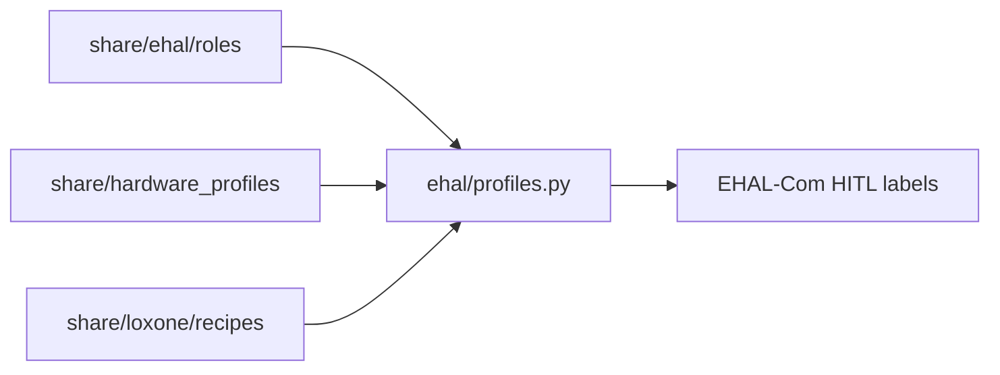

# 2.4.g — Device / hardware profile schemas (M2 slice)

**Decisions locked:** Loxone = JSON Merker/Baustein recipes only (1A). Depth = schemas + Modbus outline + validate/load + light HITL labels (2C). Full Community Bounty = **M4** (out of scope).

**Prerequisite:** `2.4.a`–`2.4.f` done (EHAL M1 + adapters + HITL mapping).

## Architecture

Three artifact families, one thin loader. Live adapters keep their hardcoded maps; templates are **mapping aids / contribution seeds**, not a new I/O path.

## 1. EHAL device-role templates

Add under [`share/ehal/`](share/ehal/):

- [`device_roles.schema.json`](share/ehal/device_roles.schema.json) — template shape:
  - `role_id` (`grid` | `pv` | `ess` | `evcs` | `consumer` | `heatpump`)
  - `label`, `description`
  - `ehal_fields[]`: `{ field, required, kind: telemetry|setpoint|capability }` referencing M1 field names from [`telemetry.schema.json`](share/ehal/telemetry.schema.json) / setpoint / capabilities
  - `capability_expectations` (e.g. ESS → `supports_ess_write`)
  - Notes on units/signs (point at frozen EHAL conventions; do not redefine math)
- Example instances in [`share/ehal/roles/`](share/ehal/roles/): `grid.json`, `pv.json`, `ess.json`, `evcs.json`, plus stubs `consumer.json` and `heatpump.json` (document that M1 wire still has no first-class HP/consumer fields — templates list intended future/flex mappings and Loxone extras where relevant)

**Do not** invent new Live telemetry fields in M1 wire schemas. Role templates *group* existing M1 fields; consumer/HP stubs are forward-looking docs for adapters/HITL.

## 2. Modbus / SunSpec outline (Path D seed)

Add under [`share/hardware_profiles/`](share/hardware_profiles/):

- [`hardware_profile.schema.json`](share/hardware_profiles/hardware_profile.schema.json) — outline only:
  - `vendor`, `model`, `protocol` (`sunspec` | `proprietary`)
  - optional `sunspec_models[]` / `registers[]` (`address`, `type`, `scale`, `unit`, `direction`)
  - `ehal_bindings[]`: register/model point → EHAL field + transform note (`scale`, `negate`)
  - `status`: `outline` | `example` (no validation engine beyond JSON Schema)
- Two stubs:
  - `examples/sunspec_inverter_ess.outline.json` — SunSpec-shaped placeholders (not a full SunSpec dump)
  - `examples/huawei_via_loxone.outline.json` — proprietary outline seeded from existing Loxone/Huawei knowledge (`target_soc` / `control_cmd` as **extras**, not new EHAL fields)

No Modbus TCP client, no ARP scan, no upload API.

## 3. Loxone counterpart recipes (JSON only)

Add under [`share/loxone/recipes/`](share/loxone/recipes/):

- [`recipe.schema.json`](share/loxone/recipes/recipe.schema.json) — per role:
  - `role_id` (same enum as device roles)
  - `recommended_markers[]`: `{ ehal_field | loxone_extra, loxone_blocks_key, suggested_name, notes }`
  - Align keys with existing [`EHAL_TO_BLOCKS`](integrations/loxone_ehal_mapping.py) + `EXTRAS_FIELDS`
  - Optional short `baustein_notes` (text: Virtual Status / Memory / Marker layout tips) — **not** a `.loxone` binary
- One recipe JSON per plant role (`grid`, `pv`, `ess`, `evcs`); consumer stub may reference flex `loxone_inputs`/`outputs` patterns from house-profile docs without implementing nested models

Cross-link German [`docs/referenz/loxone-signale.md`](docs/referenz/loxone-signale.md) from recipe README or schema description.

## 4. Thin Python loader + tests

Extend the `ehal` package (keep core wire validate untouched):

- New [`ehal/profiles.py`](ehal/profiles.py): load/validate role templates, hardware-profile outlines, Loxone recipes via `jsonschema` (same pattern as [`ehal/validate.py`](ehal/validate.py))
- Public helpers: `list_device_roles()`, `load_device_role(role_id)`, `list_hardware_profiles()`, `load_loxone_recipe(role_id)`, plus a small `role_field_labels()` map for HITL
- Tests: [`tests/test_ehal_profiles.py`](tests/test_ehal_profiles.py) — every shipped JSON validates; role↔recipe `role_id` consistency; EHAL field names in roles ⊆ M1 field set (plus documented stub-only extras for consumer/HP)

## 5. Light HITL labels (cheap only)

- Derive section/group captions from device roles in [`ui/ehal_loxone_mapping.py`](ui/ehal_loxone_mapping.py) and [`ui/ehal_ha_mapping.py`](ui/ehal_ha_mapping.py) (e.g. group rows under Netz / PV / Batterie / Wallbox)
- Prefer reading labels from `ehal.profiles` so FIELD_LABELS stay single-sourced where easy; **no** recipe auto-apply, no structure-scan changes, no save-path changes

## 6. Spec / CONTRIBUTING

- [`docs/spec/ehal.md`](docs/spec/ehal.md): new section **Device roles and hardware profiles (2.4.g)**; move Modbus library from “out of scope (M1 freeze)” to “first outline shipped; bounty = M4”; note consumer/HP templates are stubs
- [`CONTRIBUTING.md`](CONTRIBUTING.md) §4: point contributors at `share/ehal/roles/`, `share/hardware_profiles/`, `share/loxone/recipes/` as the contribution format; bounty upload still “not productive”
- Short German pointer in [`docs/ui/ehal-com.md`](docs/ui/ehal-com.md) only if HITL grouping is user-visible (one sentence)

## Explicit non-goals

- Community Bounty engine / ARP / upload / ledger (M4)
- Earnie-direct Modbus writer (Path D runtime)
- `.loxone` Config library binary
- Changing Live MILP, `loxone_adapter` I/O, or nesting Hausprofil (`2.+1`)
- Expanding M1 wire schemas with heatpump/consumer telemetry fields

## Acceptance

- All new JSON validates under the new schemas via `ehal.profiles`
- Role templates cover grid/pv/ess/evcs; consumer/HP stubs present and documented
- Modbus outline schema + 2 example stubs present
- Loxone JSON recipes for plant roles; no binary
- HITL mapping UI shows role grouping/labels without changing confirm/save behavior
- Spec + CONTRIBUTING updated; pytest green for new tests