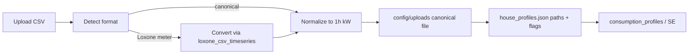

# Historical CSV Profiles (Backlog 2.+1)

Decisions locked: **phased P0→P4**; canonical columns **`timestamp;power_kw` for all consumer types**; **Loxone-style meter CSVs converted** into that format on import (not a parallel schema); live-config key **`path_log` → `path_historical_log`**; **digital consumer CSVs × `nominal_power_kw` after UI confirmation**.

## Current baseline

- House total CSV works: UI in [`ui/house_config_profile_form.py`](ui/house_config_profile_form.py) (`_render_consumption_csv_section`), loader in [`house_config/consumption_csv.py`](house_config/consumption_csv.py) (already-hourly only).
- Per-consumer `profile_csv` is read in [`data/consumption_profiles.py`](data/consumption_profiles.py) but has **no UI** (passthrough only).
- Loxone resample already exists in [`data/loxone_csv_timeseries.py`](data/loxone_csv_timeseries.py) (`Datum;Zeit;…;Leistung` → hourly mean) — reuse for conversion, do not fork a second house-profile path.
- Offline Loxone consumer logs still use `flexible_consumers[].path_log` (misleading name vs house-profile `profile_csv`).



## P0 — Rename `path_log` → `path_historical_log`

**Goal:** Clarify that this key is the offline Loxone historical meter CSV on live `flexible_consumers`, distinct from Hauskonfigurator `profile_csv` / `total_profile_csv`.

### Behavior

- Canonical key everywhere: `path_historical_log`.
- On read in [`settings/flexible_consumers.py`](settings/flexible_consumers.py) `normalize_consumer`: prefer `path_historical_log`; if empty, fall back to legacy `path_log` once, then expose only `path_historical_log` on the normalized dict.
- Writers / serializers emit only `path_historical_log` (no dual write).
- Update call sites that read the key: [`integrations/loxone_log_import.py`](integrations/loxone_log_import.py) (`load_consumer_series`), [`settings/flexible_consumers.py`](settings/flexible_consumers.py) (`consumer_path`, `consumer_has_daily_target`), [`house_config/planning_flex_bridge.py`](house_config/planning_flex_bridge.py) (empty defaults + passthrough key list), [`ui/dev/app_test_data.py`](ui/dev/app_test_data.py).
- Schema + examples: [`config/config.schema.json`](config/config.schema.json), [`config/config.json`](config/config.json), [`tests/fixtures/backtesting/config.json`](tests/fixtures/backtesting/config.json), tests that embed the key.
- Docs: [`docs/konfiguration/flexible-verbraucher.md`](docs/konfiguration/flexible-verbraucher.md), [`docs/spec/swimspa-filter.md`](docs/spec/swimspa-filter.md) — replace name; one short note that `path_log` is deprecated alias on load.

Does **not** change the offline `generate_cons_data` / `cons_data_hourly.csv` pipeline — only the config key name.

## P1 — Shared normalization + house CSV hardening

**Goal:** One import pipeline used by Gesamt-CSV (and later consumers). Reject weak files with clear errors.

### Canonical format (document + enforce)

```text
timestamp;power_kw
2023-01-01 00:00:00;3.177
```

- Delimiter `;`, UTF-8 (BOM ok), decimal `.` or `,`.
- Expected Sign of signal is pre-defined by Earnie (t.b.d). There is a extra-check to invert sign if necessary in order to fit the definition from Earnie.
- Unit: if values look like W (e.g. median ≫ 50), divide by 1000; otherwise treat as kW. Fail loudly if ambiguous rather than silent wrong scale when possible.
- Sampling → **exactly 1h**: denser → hourly **mean**; sparser → **interpolate** to hourly index.
- Length: require **≥ 365 × 24** hourly samples after normalize (calendar coverage ≥ 12 months of unique date-hours). Clear `ValueError` if short.

### Code

- Extend `[house_config/consumption_csv.py](house_config/consumption_csv.py)` (or small sibling module if LOC grows):
  - `detect_and_load_raw_series(path)` — canonical header **or** Loxone (`Datum`/`Zeit` + `Leistung` / column index 3 via existing `[load_power_hourly](data/loxone_csv_timeseries.py)`).
  - `normalize_hourly_power_kw(series) -> list[tuple[str, float]]` — unit, sign, resample, length check.
  - Keep `load_hourly_profile_csv` as the **canonical** reader used at runtime (fast path for already-normalized uploads).
- On UI upload (Gesamt): run detect → normalize → **write canonical CSV** under `config/uploads/` (reuse `[save_profile_consumption_csv](ui/house_config_io.py)`); store that path as `total_profile_csv`.
- Wire validation in `_render_consumption_csv_section` to the new pipeline.
- Tests: fixtures for canonical hourly, 15‑min mean, sparse interp, Loxone-style, sign flip, too-short rejection.
- Short German note in user docs (e.g. under `[docs/konfiguration/](docs/konfiguration/)` or house-profile section): column format + Loxone conversion + 12‑month rule.

## P2 — Per-consumer CSV UI + subtract-from-total

**Goal:** Attach historical power series per consumer; one checkbox controls real vs synthetic.

### Schema (`[house_config/profiles_store.py](house_config/profiles_store.py)` + schema JSON)

Per consumer:


| Key               | Meaning                                                                                                                                                                                                            |
| ----------------- | ------------------------------------------------------------------------------------------------------------------------------------------------------------------------------------------------------------------ |
| `profile_csv`     | Path to normalized canonical CSV (empty = none)                                                                                                                                                                    |
| `use_profile_csv` | `true` → use CSV load **and** subtract that series from house `total_profile_csv` when residual/baseload from total is computed; `false` → **synthetic** schedule/model (ignore CSV for modeling even if path set) |


Same `timestamp;power_kw` for `generic` / `ev` / `thermal_*` (no type-specific columns in v1).

### UI (`[ui/house_config_profile_form.py](ui/house_config_profile_form.py)`)

In `_render_consumer_form`: path/upload/clear mirroring Gesamt-CSV; checkbox “Aus Gesamt-CSV abziehen / echtes Profil nutzen”; on upload run P1 normalizer; save under `config/uploads/{profile_id}_{consumer_id}_…`.

### Data layer

- `[data/consumption_profiles.py](data/consumption_profiles.py)`: only prefer `profile_csv` when `use_profile_csv` is true (today any non-empty path wins).
- Same for `[house_config/baseload.py](house_config/baseload.py)` / `[generic_schedule.py](house_config/generic_schedule.py)` short-circuits on `profile_csv`.
- When building residual from `total_profile_csv`: `residual = total − Σ(consumer CSV where use_profile_csv)` (clip or warn on negative hours — prefer **warn + clip at 0** with logged count).
- Fix inconsistency: synthetic DF builders that ignore `total_profile_csv` should follow the same total/residual rules as `total_kw_at_datetime` / `build_hourly_kw_profile`.

## P3 — Verbrauchsprofil plot modes + Scenario Explorer

**Goal:** Plot and SE honor synthetic vs real the same way as Hauskonfigurator.

### Plots (`[ui/consumption_display/](ui/consumption_display/)`, modeled section)

- Mode toggle in Verbrauchsprofil:
  - **All consumers** (current stacked/multi-line view).
  - **CSV-instrumented only** (`use_profile_csv` + path): one consumer (or switcher) for live-schedule adoption review.
- Keep Ist-Gesamt overlay when `total_profile_csv` is set.

### Scenario Explorer

- Resolved `_house_profile` already flows via `house_profile_id`. Ensure overlays and synthetic/cons_data generation use `use_profile_csv` + subtraction consistently (`[ui/backtesting_scenario_consumption.py](ui/backtesting_scenario_consumption.py)`, `[data/cons_data_house_profile.py](data/cons_data_house_profile.py)`, `[docs/spec/scenario-explorer-consumption.md](docs/spec/scenario-explorer-consumption.md)`).
- No separate SE “synthetic vs real” flag beyond the house-profile settings.

## P4 — Digital signal × nominal power

**Goal:** When a consumer CSV is a digital on/off (0/1) series, ask during inspection whether to multiply by that consumer’s `nominal_power_kw`, then bake kW into the canonical file.

### Locked decisions

- **Scope:** Consumer CSVs only (`profile_csv`). House `total_profile_csv` has no single nominal — skip.
- **When:** During CSV inspection in `_render_consumer_profile_csv_fields` (after upload/path set).
- **Effect:** On confirm, scale inside the normalizer and **rewrite** canonical `timestamp;power_kw`. No schema flag; runtime readers unchanged.
- **Scale factor:** Current form `nominal_power_kw` (must be `> 0`).
- **Detection:** After unit/sign, before length check: ≥95% of finite samples within `1e-6` of `0` or `1`.

### Code

- [`house_config/consumption_csv.py`](house_config/consumption_csv.py): `is_digital_on_off_series`; optional `digital_scale_kw` on `normalize_hourly_power_kw` / `load_and_normalize_profile_csv` / `normalize_profile_csv_file`.
- [`ui/house_config_profile_form.py`](ui/house_config_profile_form.py): one session-scoped ask per path; Ja → scale + rewrite; Nein → normalize without scale.
- Docs: [`docs/konfiguration/verbrauchs-csv.md`](docs/konfiguration/verbrauchs-csv.md).
- Tests: digital detect/scale/reject in [`tests/test_consumption_csv_normalize.py`](tests/test_consumption_csv_normalize.py).

### Out of scope for P4

- Persisting a scale flag or re-scaling when `nominal_power_kw` later changes.
- Auto-scaling without confirmation.
- House Gesamt-CSV digital handling.

## Out of scope (this cycle)

- Type-specific thermal temperature columns in CSV.
- Replacing the Loxone → `cons_data_hourly.csv` pipeline (parallel track stays; P0 only renames the key).
- Changing `version.py` (ask separately if a release is desired).

## Implementation order

**P0** first (rename, low risk, naming clarity). Then ship and verify **P1** before UI for consumers; **P2** before plot/SE polish so P3 only consumes stable flags. **P4** after P2 (needs consumer form + `nominal_power_kw`).