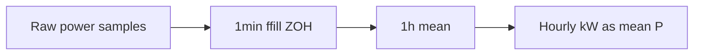

# CSV import: energy-correct hourly resample

## Problem

[`house_config/consumption_csv.py`](house_config/consumption_csv.py) `_resample_to_hourly` and [`data/loxone_csv_timeseries.py`](data/loxone_csv_timeseries.py) `_series_to_hourly` use `series.resample("1h").mean()`, which averages **samples in the bin**, not duration-weighted power. For irregular / event logs that under- or over-counts energy; regular 10/15‑min polls happen to be fine.

Loxone/Energiemonitor already mean in `_series_to_hourly` **before** normalize, so fixing only `_resample_to_hourly` would **not** correct those imports.

## Chosen approach

**ZOH everywhere** (including median gap &gt; 1h): `resample("1min").ffill()` then `resample("1h").mean()`, same as [`integrations/loxone_log_import.py`](integrations/loxone_log_import.py) lines 46–50. Drop the sparse `interpolate(method="time")` branch. Update German user docs to say hold-last (ZOH), not time-interpolation.



## Implementation

1. **Shared helper** in [`data/loxone_csv_timeseries.py`](data/loxone_csv_timeseries.py) (used by power and existing Loxone loaders):

```python
def resample_to_hourly_zoh(series: pd.Series) -> pd.Series:
    """Zero-order hold to 1 min, then hourly mean (= ∫P dt / 1h)."""
    cleaned = series.dropna().sort_index()
    cleaned = cleaned[~cleaned.index.duplicated(keep="last")]
    if cleaned.empty:
        return cleaned
    minutely = cleaned.resample("1min").ffill()
    return minutely.resample("1h").mean().dropna()
```

2. **Wire `_series_to_hourly`** to call `resample_to_hourly_zoh` instead of bare `.mean()` — covers `load_loxone_value_hourly`, `load_hourly_series`, Energiemonitor.

3. **Wire `_resample_to_hourly`** in [`house_config/consumption_csv.py`](house_config/consumption_csv.py) to the same helper; remove median-delta / interpolate branching.

4. **Optional small cleanup:** [`integrations/loxone_log_import.py`](integrations/loxone_log_import.py) call the helper (binary scale still applied on minutely or after — keep current order: ffill then `* wp_power` then hourly mean, or scale before helper; match today’s behavior).

5. **Docs:** [`docs/konfiguration/verbrauchs-csv.md`](docs/konfiguration/verbrauchs-csv.md) — change “Mittelwert … Interpolation bei lückenhaften” to: denser samples → ZOH then hourly mean; gaps → last value held until next sample.

## Tests

Extend [`tests/test_consumption_csv_normalize.py`](tests/test_consumption_csv_normalize.py):

- **Irregular pulse:** samples at `:00` = 3.5 kW, `:10` = 0 → hourly value ≈ `3.5 * 10/60` (not `1.75`).
- **Regular 15‑min:** keep existing constant-power case; add varying powers where `sum(hourly) == sum(P_i * 0.25)`.
- **Sparse gap:** two samples 3 h apart at constant P → intervening hours equal that P (ZOH), not linear midpoints.

Energiemonitor / Loxone smoke tests should still pass (regular ~10 min → nearly unchanged totals).

## Out of scope

- Re-importing already-normalized files under `config/uploads/` (user must re-upload event-style CSVs to benefit).
- Changing `estimate_annual_kwh_from_profile_csv` (still `sum(hourly_kW)`; correct once hourly means are ZOH-based).
- `version.py` bump.