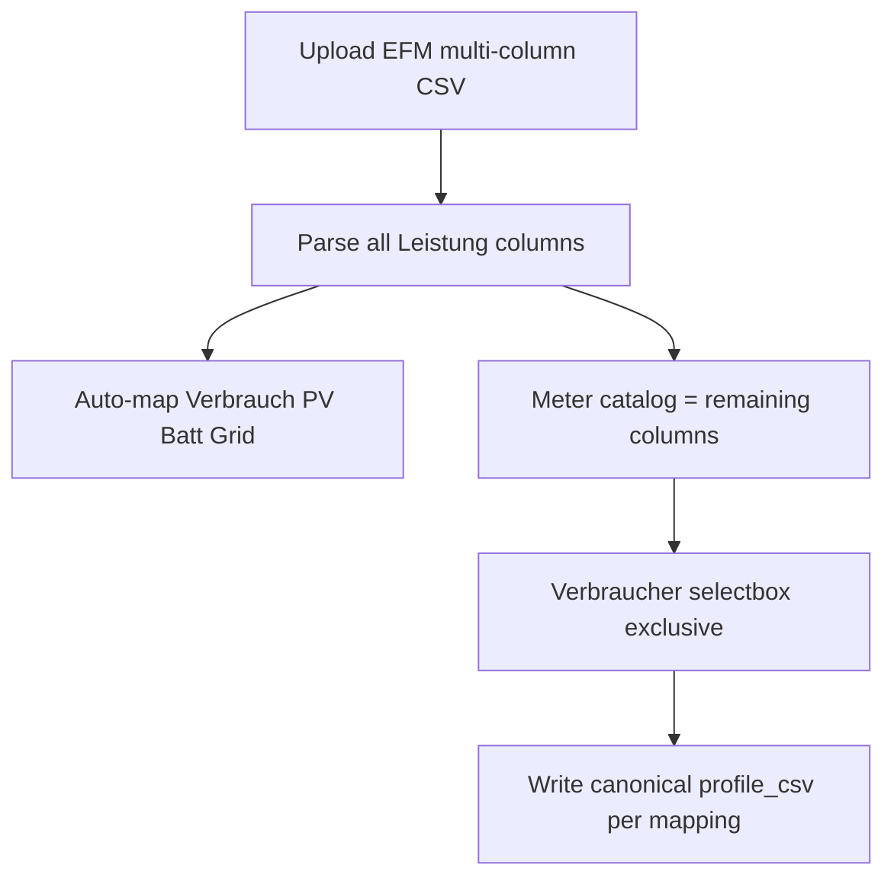

# Energieflussmonitor CSV import + meter↔consumer mapping

Extends the docs-only blueprint in [`.cursor/plans/energieflussmonitor_hausprofil_blueprint_a.plan.md`](.cursor/plans/energieflussmonitor_hausprofil_blueprint_a.plan.md) with **HK implementation**. Scope is **CSV import only** (no live/daemon). Auto-create consumers (interpretation C) stays under **2.4** MCP.

**Locked decisions**
- Assume EFM Statistik export is one multi-column file with house roles + all Verbraucher Leistungsflüsse.
- House roles: **auto-map** (option A); expand aliases if names differ from old Energiemonitor.
- Per-Verbraucher: meter **selectbox** replaces CSV upload when EFM mode is active and a raw file is present.
- Exclusive assignment: a meter chosen on one consumer is unavailable on others (Streamlit cannot grey selectbox options; omit taken meters + short caption listing assignments).

## 1. Data model

**House profile** ([`share/config/house_profiles.schema.json`](share/config/house_profiles.schema.json), [`house_config/profiles_store.py`](house_config/profiles_store.py)):

- `historical_csv_source` enum += `"energieflussmonitor"`
- New optional `energieflussmonitor_csv`: portable path to the kept raw multi-column file under `config/uploads/`
- Existing `total_profile_csv` / `pv_profile_csv` / `battery_profile_csv` / `grid_profile_csv` still filled by auto-extract on upload (same as today’s Energiemonitor path)

**Consumer**:

- New optional `efm_meter_column`: exact CSV header string (or stable normalized key) of the chosen Leistungsfluss
- Keep writing `profile_csv` + `use_profile_csv` so SE/HK residual paths stay unchanged

## 2. Parse layer

Extend [`data/energiemonitor_csv.py`](data/energiemonitor_csv.py) (or thin sibling `data/energieflussmonitor_csv.py` if LOC grows):

- Discover **all** power columns (`Leistung …` / `[kW]` heuristics), not only the four fixed roles
- Classify house roles with **expanded aliases**, e.g.:
  - Verbrauch: existing + plausible EFM variants
  - PV: `produktion`, `erzeuger`, …
  - Batterie: `batterie`, `speicher`, …
  - Netz: `energieversorger`, `netz`, …
- Return `{roles: {verbrauch|produktion|…}, meters: [{column, label}, …]}`
- `looks_like_energieflussmonitor`: multi Leistung columns beyond the classic four (or source mode forces this parser)

Import helpers in [`house_config/consumption_csv.py`](house_config/consumption_csv.py) + [`ui/house_config_io.py`](ui/house_config_io.py):

- `save_energieflussmonitor_profile_csvs`: store raw → extract house series → return paths + meter catalog metadata (catalog can be re-read from raw path anytime)
- `export_efm_meter_to_consumer_csv(raw_path, column, dest)`: hourly normalize one meter → canonical `profile_csv`

## 3. Historische Jahresprofile UI

File: [`ui/house_config_historical_csv.py`](ui/house_config_historical_csv.py)

Radio **order** and labels:

1. `balance` — Bilanz (PV + Batterie + Netz → Verbrauch)
2. `separate` — Getrennte CSVs (Verbrauch + optional PV-Ertrag)
3. `energieflussmonitor` — Loxone Energieflussmonitor (Neuer Baustein)
4. `energiemonitor` — Loxone Energiemonitor (Alter Baustein)

New `_render_energieflussmonitor_mode`: one upload (like Energiemonitor), QC plot for extracted house series, clear button also clears `energieflussmonitor_csv` and consumer `efm_meter_column` mappings that depended on it (or leave stale mappings with warning — prefer clear mappings on remove).

## 4. Verbraucher CSV editor

File: [`ui/house_config_profile_form.py`](ui/house_config_profile_form.py) — `_render_consumer_profile_csv_fields`

When `historical_csv_source == energieflussmonitor` **and** raw EFM path exists:

- Replace upload/path widgets with selectbox: `— keiner —` + available meters
- Options for consumer *i*: unassigned meters ∪ this consumer’s current `efm_meter_column`
- On change: slice column → `save`/`queue` `profile_csv`; persist `efm_meter_column`; auto-suggest enabling „Von Basis-Last abziehen“ when a meter is set (same as upload flow today when path becomes non-empty)
- Clear selection → clear `efm_meter_column` + `profile_csv`
- Caption: list meters already assigned to other consumers

When not in EFM mode: keep current upload UI unchanged.

Pass house-level EFM context into the consumer renderer (preview session / historical save fields) without reading disk on every widget if avoidable — catalog from raw header is cheap.

## 5. Section order

In `render_house_profile_tab()` ([`ui/house_config_profile_form.py`](ui/house_config_profile_form.py)): move `_render_consumption_csv_section` (**Historische Jahresprofile** + Gesamtverbräuche) **above** `st.subheader("Verbraucher")`, after location fields. Keep baseload metrics after consumers; keep dual auto-save passes coherent (CSV fields available when saving from either block).

## 6. Docs + backlog + tests

- German docs: [`docs/konfiguration/verbrauchs-csv.md`](docs/konfiguration/verbrauchs-csv.md) — new mode, radio order, meter mapping; short Handbuch pointer if needed
- Follow [`.cursor/skills/streamlit-doc-links/SKILL.md`](.cursor/skills/streamlit-doc-links/SKILL.md) if headings/labels change
- Backlog under **2.3**: open item for this UX (blueprint research already archived)
- Tests: parser discovers meters + role aliases; exclusive mapping helper; import writes consumer canonical CSV from column; UI-light unit tests for option filtering

## Out of scope

- Auto-create consumers from meter list (C / 2.4)
- Live marker wiring from `efm_meter_column`
- Nested Verteiler trees
