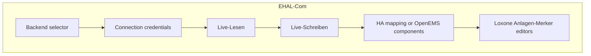

# EHAL-Com: unified smarthome connection & debug

## Locked decisions

- **Depth C:** connection hub + backend-aware live-read/write parity (not connection-only).
- **Page name:** **EHAL-Com** (nav + UI title).
- **First-run:** backend-aware (pick Loxone / HA / OpenEMS, then collect that hub’s credentials).
- **Secrets stay as today:** Loxone → `.env`; HA token + OpenEMS password → `config.json` `ehal.*` (no secret-store migration in this item).
- **Module filenames** stay (`page_loxone_debug.py`, `loxone_debug.py`) to limit churn; user-facing strings, `url_path`, and docs rename.

## Target page layout

| Backend | Credentials | Live-Lesen | Live-Schreiben | Extra |
|---------|-------------|------------|---------------|-------|
| Loxone | IP/user/pass → `.env` | existing merker table + verify | existing `loxone_writes` / silent `loxone_sent` | Anlagen-Merker / Event-Trigger |
| HA | URL + token → `ehal.ha` | EHAL telemetry table via adapter | `ehal_writes` + write-error banner | existing entity→EHAL mapping |
| OpenEMS | URL/user/pass/components → `ehal.openems` | same EHAL telemetry table | same `ehal_writes` path | connection form only (no entity map) |

## 1. Remove sidebar credentials

- Delete / no-op [`render_deferred_loxone_sidebar`](ui/setup_progress.py) and its call in [`app.py`](app.py).
- Point all “enter credentials” copy to **Daemon Control → EHAL-Com** (or first-run page).
- Update [`tests/test_setup_progress.py`](tests/test_setup_progress.py).

## 2. Backend-aware first-run

Replace Loxone-only gate with hub readiness:

- Extend [`runtime_store/dotenv_io.py`](runtime_store/dotenv_io.py) (or small new helper module, e.g. `runtime_store/ehal_setup.py`):
  - `active_ehal_backend()` from `config.json` `ehal.backend` (empty/`loxone`/`none` → Loxone).
  - `hub_credentials_configured(backend)` — Loxone: existing `.env` check; HA: `base_url`+`token`; OpenEMS: `base_url` (+ user/pass defaults ok).
  - Rename conceptually: `needs_loxone_setup()` → used as **needs hub setup** (keep function name or add alias + migrate callers): block only when not deferred and hub creds missing.
  - `require_loxone_credentials_for_config()` → **False** when active backend is `ha` or `openems`.
- Replace [`render_loxone_setup_page`](ui/setup_dotenv.py) with a backend-aware page: select backend → persist `ehal.backend` → show matching credential form → save → `reinit_config` / continue.
- Greenfield deferred planning (`loxone_setup_deferred`) stays: no blocking first-run during planning; credentials later on **EHAL-Com**.

## 3. EHAL-Com page: connection hub

In [`ui/pages/page_loxone_debug.py`](ui/pages/page_loxone_debug.py) (title **EHAL-Com**):

- Top section **Anbindung**: `st.selectbox` backend → write `ehal.backend` via `load_main_config` / `save_main_config` + `config.reinit_config` + `ehal_live.reset_adapter_cache()`.
- Show Loxone credential form on page when backend=Loxone (reuse [`render_loxone_credentials_form`](ui/setup_dotenv.py)).
- Extract HA URL/token fields into a shared connection strip; keep mapping UI in expander (reuse [`ui/ehal_ha_mapping.py`](ui/ehal_ha_mapping.py)).
- New OpenEMS connection form (fields from [`share/config/ehal.openems.snippet.json`](share/config/ehal.openems.snippet.json)) persisting `ehal.openems` + `backend=openems`. Prefer a small new module `ui/ehal_openems_connection.py` (~≤40 LOC helpers) rather than bloating the HA module.
- Nav: [`ui/navigation.py`](ui/navigation.py) title → `EHAL-Com`; `url_path` → `ehal-com`; sync `PAGE_DOCS` / `NAV_DOC_PAGE_KEYS` / `page_docs_key` per streamlit-doc-links skill.

## 4. Live-Lesen / Live-Schreiben parity (depth C)

### Live-Lesen

- Loxone: keep current fragment + verify button.
- HA/OpenEMS: replace the “not maßgeblich” info stub with an auto-refresh fragment that calls `ehal_live.get_network_adapter().read_telemetry()` (and optionally `read_live_power_kw()` summary), table of EHAL fields / values / age / errors.
- Connectivity test button per hub (“Verbindung testen”).

### Live-Schreiben

- Today EHAL path sets `loxone_writes = None` in [`main.py`](main.py) (~255–265), so the write table is empty.
- Add a compact write trace for EHAL (e.g. `ehal_writes` list of `{field, value, success, written_at, message}`) when ESS/EVCS writes run; persist into `optimizer_run_state` alongside existing keys.
- UI: if network backend, render `ehal_writes` (and silent intended setpoints); keep Loxone table for Loxone backend. Keep existing write-error banner from `ehal_write_error.json`.

## 5. Markers / gates (bounded)

- Keep Anlagen-Merker / Event-Trigger editors on the page (Loxone production still primary until 2.5); collapse or caption when backend is HA/OpenEMS (“Loxone-Marker — for legacy / future Loxone-EHAL”).
- Do **not** fully implement `_loxone_markers_complete()` in this item (still stub).
- Do **not** relax strict `loxone_blocks` load in config loaders here (HA/OpenEMS labs already ship placeholders).

## 6. Docs & tests

German user docs (same change set):

- Rename/retitle [`docs/ui/loxone-kommunikation.md`](docs/ui/loxone-kommunikation.md) → `docs/ui/ehal-com.md` (or keep path + change H1 — prefer rename for clarity).
- Update handbook §, [`docs/README.md`](docs/README.md), [`docs/ui/betriebsmodi.md`](docs/ui/betriebsmodi.md), [`docs/einrichtung/loxone-anbindung.md`](docs/einrichtung/loxone-anbindung.md), [`docs/einrichtung/ha-evcc.md`](docs/einrichtung/ha-evcc.md), [`docs/einrichtung/openems-lab.md`](docs/einrichtung/openems-lab.md) references, [`docs/spec/ha-lab-setup.md`](docs/spec/ha-lab-setup.md) Streamlit path.
- [`ui/doc_links.py`](ui/doc_links.py): primary handbook fragment `ehal-com`.

Tests to extend/adjust:

- Navigation / doc_links / setup_progress / dotenv gates.
- New: backend selector persist; OpenEMS form save; EHAL live-read UI helper (mocked adapter); `ehal_writes` serialization from main/ehal_live.
- Existing HA mapping tests remain green.

## Out of scope

- Moving HA/OpenEMS secrets into `.env`.
- Full flex-consumer / event I/O on EHAL (2.5).
- Real Live-Cockpit unlock via marker completeness.
- LoxBerry plugin (`2.4.d`).

## Backlog

After implementation: move the follow-up line from [`backlog/Backlog.md`](backlog/Backlog.md) L30 into [`backlog/Backlog-Erledigt.md`](backlog/Backlog-Erledigt.md) (only when work is done — not during plan-only phase).
