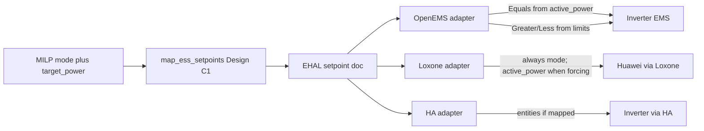

# EHAL ESS Design C1 — `set_ess_active_power`

## Correction vs your last question

**OpenEMS does not ignore `set_ess_active_power`.** That field is the portable force/setpoint.

| Field | OpenEMS | Loxone / HA |
|-------|---------|-------------|
| `set_ess_active_power` | **Use** → `SetActivePowerEquals` (signed W; omit/clear on Automatik) | Write Merker / entity; Loxone→Huawei uses it as Zielleistung |
| `set_ess_charge_power_limit` | **Use** → `SetActivePowerGreaterOrEquals` (−\|W\|) | True max charge cap |
| `set_ess_discharge_power_limit` | **Use** → `SetActivePowerLessOrEquals` (+\|W\|) | True max discharge cap |
| `set_ess_mode` | **Ignore** | **Required** control mode (Huawei Steuerbefehl / HA automation) — see sticky-value note below |

## Sticky backends — `set_ess_mode` is mandatory (docs requirement)

Loxone (and similar HA entity holds) keep the **last written value**. Omitting `set_ess_active_power` on the EHAL wire does **not** clear the Merker; a stale Sollleistung (e.g. −3 kW from the previous hour) remains visible to Config/Huawei.

Therefore:

- **`set_ess_mode` is not optional documentation fluff** for Loxone/HA — Earnie **always writes it** on every ESS setpoint cycle.
- **Automatik / inverter free** = `set_ess_mode = 0`. Config must treat mode 0 as “ignore Sollleistung / release force,” even if `Ernie_Batterie_Sollleistung` still holds an old number.
- Docs (`ehal.md`, `ehal-com.md`, `loxone-anbindung.md`, `loxone-signale.md`, Plant VI comments, `ess` recipe notes) must state this explicitly: **do not infer Automatik from absent/`null` active power alone on sticky Merker paths.**
- Earnie may still **omit** `set_ess_active_power` on the EHAL JSON for OpenEMS (no Equals write). For Loxone Live writes, either omit the active-power Merker write on Automatik **or** write a sentinel only if Config documents it — authoritative free/auto signal remains **`set_ess_mode = 0`**.

## Portable semantics (freeze in docs + schema)

Sign convention matches existing ESS power: **+ = discharge, − = charge** (same as `sens_ess_power`).

Earnie Live mapping from optimizer `(mode, target_power_kw)` → EHAL (W on wire; Loxone Merker remain kW via existing adapter conversion):

| Optimizer mode | `set_ess_active_power` | charge_limit | discharge_limit | `set_ess_mode` |
|----------------|------------------------|--------------|-----------------|---------------|
| 0 Automatik | **omit** on EHAL (OpenEMS: no Equals); Loxone relies on **mode=0** because Merker stay sticky | battery max W | battery max W | **0 (always written)** |
| 1 Zwangsladen | `−target` | max W | **0** | **1 (always written)** |
| 2 Entladesperre | omit (or 0 if backend needs idle) | max W | **0** | **1 (always written)** |
| 3 Zwangsentladen | `+target` | **0** | max W | **2 (always written)** |

Limits are **never** overloaded with the force magnitude. Force lives only in `set_ess_active_power`. Mode is the sticky-backend authority for Automatik vs force.

Bump setpoint `schema_version` **2 → 3** (new required-capable field in `anyOf`; update [`share/ehal/setpoint.schema.json`](share/ehal/setpoint.schema.json), [`ehal/models.py`](ehal/models.py), `EHAL_SCHEMA_VERSION`, validators/tests).

## Earnie algorithm / write path

Replace Huawei-era “force encoded in charge/discharge legs” with a C1 mapper:

- Refactor [`map_huawei_modbus_values`](integrations/loxone_client.py) → e.g. `map_ess_setpoints(mode, target_power_kw, max_power_kw)` returning active_power + limits + mode (keep thin deprecated wrapper only if tests need it briefly).
- Update [`write_ess_limits_from_huawei`](integrations/ehal_live.py) (rename to `write_ess_setpoints_from_control` or similar) to emit `set_ess_active_power` when present.
- Update classic Loxone path [`send_huawei_modbus_states`](integrations/loxone_client.py) / snapshot builders to write four Merker bindings: active power, charge limit, discharge limit, mode.
- Extend legacy config keys / `plant.ehal_bindings` for the new field (e.g. `target_active_power_name` → `set_ess_active_power`); keep existing charge/discharge/mode bindings as true limits + hint.
- MILP / `optimizer/battery.py` mode derivation stays; only the **southbound encoding** changes.

## Adapters

- **OpenEMS** ([`integrations/openems_adapter.py`](integrations/openems_adapter.py)): if `set_ess_active_power` present → write `SetActivePowerEquals`; always map limits as today; **do not** write `set_ess_mode`. Document Automatik = omit active_power (no Equals write / clear if REST supports it; if clear is unavailable, lab-note the limitation).
- **Loxone** ([`integrations/loxone_adapter.py`](integrations/loxone_adapter.py)): **always write** `set_ess_mode`; write active_power Merker (kW, signed) when present in the setpoint doc; write limits. Config must gate Sollleistung on mode ≠ 0.
- **HA** ([`integrations/ha_adapter.py`](integrations/ha_adapter.py)): write entity for `set_ess_active_power` when mapped; do **not** map watts onto `number.evcc_battery_grid_charge_limit` (price). Update [`share/config/ehal.ha.snippet.json`](share/config/ehal.ha.snippet.json) accordingly (active_power → empty or a real power `number`/`input_number`; leave price entities unmapped).

## Loxone templates / greenfield contract (2.4.n alignment)

Update in lockstep (names use existing **`Ernie_`** map prefix; fix template `Earnie_` / `Ladeleistung_Limit` drift):

- [`share/loxone/greenfield_device_map.json`](share/loxone/greenfield_device_map.json): add `Ernie_Batterie_Sollleistung` → `set_ess_active_power`; keep `Ernie_Ladegrenze` / `Ernie_Entladegrenze` as true limits; keep `Ernie_Steuerbefehl` → `set_ess_mode` (**required** sticky mode, not optional hint).
- [`share/loxone/recipes/ess.json`](share/loxone/recipes/ess.json): same fields + sticky/Automatik notes.
- [`share/loxone/templates/VirtualIn/VI_Earnie_Plant.xml`](share/loxone/templates/VirtualIn/VI_Earnie_Plant.xml): add VI cmd for Sollleistung; Comments state C1 + “mode 0 = free even if Sollleistung stale”; example JSON; align Titles to frozen map names.
- [`share/loxone/templates/README.md`](share/loxone/templates/README.md): Plant ESS C1 + sticky Merker / mode-0 rule.

Loxone Config: `Steuerbefehl` gates whether Sollleistung is applied; limits are caps. Force is not inferred from limits.

## Docs + roles + tests

- Spec must document sticky-Merker rule and required `set_ess_mode` on every write cycle: [`docs/spec/ehal.md`](docs/spec/ehal.md), German [`docs/ui/ehal-com.md`](docs/ui/ehal-com.md), [`docs/einrichtung/loxone-anbindung.md`](docs/einrichtung/loxone-anbindung.md), [`docs/referenz/loxone-signale.md`](docs/referenz/loxone-signale.md), [`share/ehal/roles/ess.json`](share/ehal/roles/ess.json), Huawei outline example.
- Tests: mapper table, `write_ess_*`, OpenEMS Equals path, Loxone/HA writes, contract backends, greenfield map/recipe consistency.
- Backlog: add open item under 2.4 (e.g. **2.4.o — EHAL ESS active power Design C1**) so 2.4.n templates consume the frozen contract; do not bump `version.py` unless you approve later.

## Out of scope

- Teaching evcc a kW house-battery force API (not available); HA path stays entity-mapped only.
- Changing MILP economics / mode derivation logic beyond southbound encoding.
- Config re-export of VI XML (still manual after draft edit).
