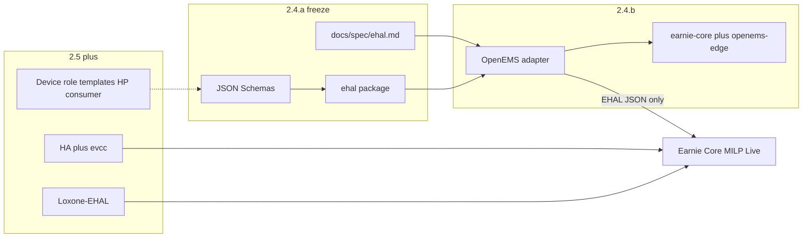

# 2.4.a — EHAL specification (Phase 1 / M1 spec)

## Decisions (locked)

- **Deliverables = B:** English connector-author spec + machine-readable JSON Schemas + thin Python package (`ehal/`) for TypedDicts/models + schema validation that **2.4.b** can import. No Live/`main.py`/Loxone wiring in this chapter.
- **Field set = minimal M1 only** (Entwicklungsplan §2.2 / §2.4.1). Loxone extras (`target_soc`, `control_cmd`, flex enable, EV kW setpoint) documented as **out of scope until 2.5** — not reserved as first-class frozen fields.
- **Units:** power telemetry and ESS power limits in **W**; `ess_soc` in **%**; EVCS setpoint as **`set_evcs_max_current` in A**. Adapters convert from hub-native units.
- **Sign:** `+` = grid import, `−` = export; adapters normalize before emitting EHAL JSON.
- **Cadence:** minimum telemetry update interval **60 s** (adapters may poll faster internally; core must tolerate stale-until-next).

## When to check OpenEMS architecture

| Scope | When | What |
|-------|------|------|
| Grid / PV / ESS / EVCS (M1 minimal) | **Light check in 2.4.a** | Confirm frozen names/units/signs align with OpenEMS `_sum/*`, `ess0/*`, EVCS MaxCurrent so the freeze is implementable |
| Same, deep channel map + lab writes | **2.4.b** | Full REST/WS mapping, Compose, OEM write-lock Negativtests, capability degrade |
| Heatpump | **Not 2.4** | No HP fields in M1 EHAL; later Thermals / flex-consumer EHAL extension (and/or **2.5.c** device-role templates) |
| Generic consumer | **Not 2.4** | Today Loxone flex markers; EHAL consumer roles after Loxone extraction / device profiles (**2.5.a / 2.5.c**) |

So: **2.4.a** only does a desk-check against OpenEMS docs/`docs/spec/openems-testing-platform-todo.md` for the eight M1 fields — not a full OpenEMS device-catalog architecture review.

## Deliverables

### 1. Spec doc — [docs/spec/ehal.md](docs/spec/ehal.md) (new, English)

Canonical Phase-1 freeze covering:

- Purpose / naming (**EHAL**, not “SAM”)
- Contract: optimizer / Live consume **only** EHAL types; no OpenEMS/HA/Loxone types in math core (Loxone production path stays pre-EHAL until **2.5** — stated explicitly)
- Telemetry-API, Setpoint-API, Capability-Flags field tables (required vs optional, units, signs)
- Envelope: timestamp (`ts` ISO-8601 or epoch ms — pick one and freeze), adapter id, schema version
- Min update interval (60 s), stale/missing-field behavior
- Write failures → log + UI hint + flip `supports_ess_write` / `supports_evcs_current` + **Write-Error-Telemetry** object shape
- Fehlertoleranz defaults to freeze (e.g. missing optional telemetry → omit/null; missing required `ess_soc` → run abort for Live; failed write → degrade, do not crash optimizer)
- Out of scope: MQTT/Matter hubs; Loxone refactor; HP/generic-consumer roles; hardware Modbus profiles (M2/M4)
- Pointer to OpenEMS light alignment table (reuse §2.4.1 / openems TODO)

### 2. JSON Schemas — under `share/ehal/` (new)

Three (or one combined) draft-07 schemas, following existing `share/config/*.schema.json` style:

- `telemetry.schema.json` — `grid_power_active`, `pv_production_active`, `ess_soc`, optional `ess_power`, `evcs_active_power`
- `setpoint.schema.json` — `set_ess_charge_power_limit`, `set_ess_discharge_power_limit`, `set_evcs_max_current`
- `capabilities.schema.json` — `supports_ess_write`, `supports_evcs_current` (+ room for future bools without breaking required set)
- Shared envelope / `write_error` fragment as needed

### 3. Thin Python package — `ehal/` (new)

- Dataclasses or TypedDicts mirroring the schemas
- `validate_*` helpers loading schemas from `share/ehal/` (or vendored copies if path policy requires)
- No network I/O, no OpenEMS/HA imports
- Unit tests: valid/invalid fixtures for sign, units, required fields, write-error shape

### 4. CONTRIBUTING outline — [CONTRIBUTING.md](CONTRIBUTING.md)

Short German section (file is German) pointing connector authors to `docs/spec/ehal.md`: translate-only, normalize signs, report capabilities, network-only / Separate Works, no hub logic in core. Replace the vague “Später sollen generische Connector-Specs…” placeholder with a concrete link.

### 5. Cross-links only (no adapter code)

- Update [docs/spec/openems-testing-platform-todo.md](docs/spec/openems-testing-platform-todo.md) to point at `docs/spec/ehal.md` as the frozen contract
- Leave [backlog/Backlog.md](backlog/Backlog.md) `2.4.a` open until acceptance; archive on completion per backlog rules

## Explicit non-goals (this chapter)

- OpenEMS / HA adapters, Compose stacks (**2.4.b / 2.4.c**)
- Changing `main.py`, `integrations/loxone_client.py`, or MILP inputs to EHAL
- Heatpump / generic-consumer EHAL fields
- `version.py` bump

## Acceptance

- Schemas + `ehal/` tests green
- `docs/spec/ehal.md` freezes fields, signs, units, 60 s cadence, write-error/degrade
- CONTRIBUTING links the adapter contract
- Desk-check note in the spec: M1 fields map to known OpenEMS channels; deep OpenEMS architecture deferred to **2.4.b**; HP/consumer to **2.5+**
