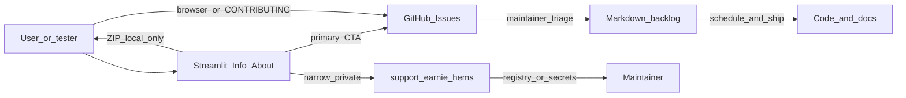

# GitHub ticket intake — concept (evolves 2.4.r)

## Verdict on the current backlog text

[backlog/Backlog.md](backlog/Backlog.md) lines 37–48 already have the right split (**Issues = intake**, **markdown = schedule**, **mail = private exception**, **no auto-upload**). What is missing is a crisp **operating model**: channel matrix, triage into backlog, Streamlit UX shape, and removal of soft optionality (“optional Discussions”, “or private Issues”).

This concept **keeps** that split and **tightens** it into three layers with fixed defaults for ship.

## Three-layer model

| Layer | Channel | Role | Source of truth for |
| --- | --- | --- | --- |
| **A — Intake** | GitHub Issues (`JochenTCC/Earnie`) | Report, discuss, label, close | “What was reported / decided in public” |
| **B — Schedule** | `backlog/Backlog.md`, `Backlog-Bugfixes.md`, `Backlog-Erledigt.md` | When/how work ships (letters, phases, ship gates) | “What we build next” |
| **C — Private** | `support@earnie-hems.com` only | Registry fingerprint, secrets, dumps unsuitable for public | Exceptional support artifacts |

**Address decision:** one Layer-C mailbox — `support@earnie-hems.com` (not `mail@`, not a second parallel address). Registry and private Kontakt share it; distinguish by subject.

**Hard rules (evolve backlog wording):**

- Issues never auto-become backlog rows; a maintainer **promotes** an Issue into markdown (with `#NN` link) when it is scheduled.
- Markdown never replaces Issues for external discussion; backlog stays internal planning.
- **No GitHub Discussions** in this ship (defer). Ideas land as Issue type *Improvement* / *Question*.
- **No private GitHub Issues** as a product path (repo stays public; private = mail only).
- Config packs / Kontakt-ZIP / debug dumps are **never** uploaded by the app; ZIP remains local download.

## Issue taxonomy (repo setup)

Four issue forms under `.github/ISSUE_TEMPLATE/` (YAML forms), matching the backlog list:

| Template | Labels (create) | Typical promote target |
| --- | --- | --- |
| Bug | `bug` | `Backlog-Bugfixes.md` |
| Change request | `change-request` | `Backlog.md` feature chapter or follow-up |
| Improvement | `improvement` | `Backlog.md` / Research |
| Question / support | `question` | Usually answer+close; only rare promote |

Shared labels: `cloud-demo`, `needs-triage`, `privacy-sensitive` (manual — means “do not paste dumps; switch to mail”).

`config.yml` contact links: website `https://earnie-hems.com`, docs, and a short note that registry / secrets go to `support@earnie-hems.com`.

## Streamlit Kontakt — evolve, don’t fork

Today ([`ui/info_sidebar.py`](ui/info_sidebar.py)): Thema + Beschreibung → `build_mailto_url` → **E-Mail schreiben**, plus local ZIP. Registry stays separate mailto in [`ui/truth_banner.py`](ui/truth_banner.py). Cloud demo uses personal mailto in [`runtime_store/cloud_demo.py`](runtime_store/cloud_demo.py).

**Target UX (Info / About → Kontakt):**

1. Select **Art** (Bug / Änderungswunsch / Verbesserung / Frage) — maps to template + labels.
2. Keep **Thema** / **Beschreibung**.
3. Caption: Issues are **public**; no passwords, hostnames, customer names, full config; scrub / aliases.
4. Primary CTA: **GitHub-Issue öffnen** → `OFFICIAL_REPO_URL/issues/new?...` with `title`, `body`, `labels` (and `template=` when forms exist).
5. Keep **Informationen in ZIP sammeln** as offline aid; caption: ZIP stays on the device; for public Issues paste only safe excerpts; for sensitive material use private mail and attach ZIP there.
6. Secondary expander **Privater Support (Registry / vertraulich)**: short when-to-use copy + existing registry mailto + optional general private mailto (Thema/Beschreibung), address `support@earnie-hems.com` (`SUPPORT_EMAIL`).
7. Sidebar links: Handbuch (existing), **earnie-hems.com**, **GitHub / Issues** (reuse `OFFICIAL_REPO_URL`).

**Shared helper** (e.g. `ui/github_issue_url.py` or next to mailto helpers): `build_github_issue_url(kind, topic, description, *, extra_labels=())` using `OFFICIAL_REPO_URL` from [`ui/truth_banner.py`](ui/truth_banner.py). Prefill body includes a short DSGVO reminder block (German), version if cheap to include, and “do not paste secrets”.

**Cloud-demo feedback:** same Issue builder with label `cloud-demo` (replace `jochen@techcreacon.com` mailto as primary). Optional ZIP after consent stays download-only; caption points to `support@` if the pack must leave the user’s machine.

**Registry:** unchanged flow (mail-only); set `SUPPORT_EMAIL` / docs to `support@earnie-hems.com`.

## Maintainer triage (fits existing backlog culture)

Lightweight rule to document in `CONTRIBUTING.md` (and optionally one sentence in backlog item):

1. New Issue → `needs-triage`.
2. Answer / close, or label and leave open for discussion.
3. When work is scheduled → add markdown checklist item with `Fixes #NN` / link; remove from “floating” Issue-only state by referencing it.
4. Bugfixes still follow `Backlog-Bugfixes.md` verification chapters; Erledigt stays archive.

This **evolves** CONTRIBUTING’s current dual table (App=mail, GitHub=ideas) into: App+GitHub = Layer A; mail = Layer C; Roadmap = Layer B.

## Docs & address cleanup (in scope of the same chapter)

- German user docs: [docs/user-manual/Benutzer-Handbuch-Earnie.md](docs/user-manual/Benutzer-Handbuch-Earnie.md), [docs/ui/betriebsmodi.md](docs/ui/betriebsmodi.md), [docs/einrichtung/private-env.md](docs/einrichtung/private-env.md) — Kontakt → Issues primary; `support@` only for registry/private.
- [CONTRIBUTING.md](CONTRIBUTING.md) contact table rewrite to the three-layer matrix.
- Replace remaining `*@techcreacon.com` (and any `mail@earnie-hems.com` in backlog/docs) with `support@earnie-hems.com` **only** on Layer C paths (`SUPPORT_EMAIL`, registry mailto, private-support mailto). Do not keep mail as default public feedback.

## Suggested backlog rewrite (concept → item text)

Replace the bullet cluster under **GitHub ticket intake & Streamlit Kontakt → Issues** with this contracted scope:

- **Model:** Issues = public intake; markdown backlog = schedule SoT; `support@earnie-hems.com` = sole private exception (registry / secrets / dumps). No Discussions in this ship.
- **Repo:** four issue forms + labels; contact links to site/docs.
- **UI:** Kontakt Art + Thema/Beschreibung → primary Issue URL; ZIP local; public warning; private expander; site + repo links; cloud-demo → Issues (`cloud-demo`).
- **Docs:** CONTRIBUTING + Benutzer-Handbuch + betriebsmodi (+ private-env cloud note); techcreacon / `mail@` → `support@earnie-hems.com` only on private paths.
- **Done when:** templates live; primary CTA is Issue not mailto; registry still mail to `support@`; no auto-upload; tests cover URL builders; docs match.

## Implementation sketch (after concept approval)

Not required to accept the concept, but the natural execution order:

1. `.github/ISSUE_TEMPLATE/*` + labels via template frontmatter.
2. Shared `build_github_issue_url` + tests (mirror [`tests/test_info_sidebar.py`](tests/test_info_sidebar.py) / cloud-demo mailto tests).
3. Rework [`ui/info_sidebar.py`](ui/info_sidebar.py); keep mailto builders for Layer C.
4. Rework cloud-demo feedback CTA; set `SUPPORT_EMAIL` / registry to `support@earnie-hems.com`.
5. Docs + CONTRIBUTING; tighten backlog item wording to the contracted list above.

## Out of scope (explicit)

- GitHub Discussions, private Issues, API-based Issue creation (needs token), auto-attaching ZIP to Issues, changing license/banner, Donate CTA.