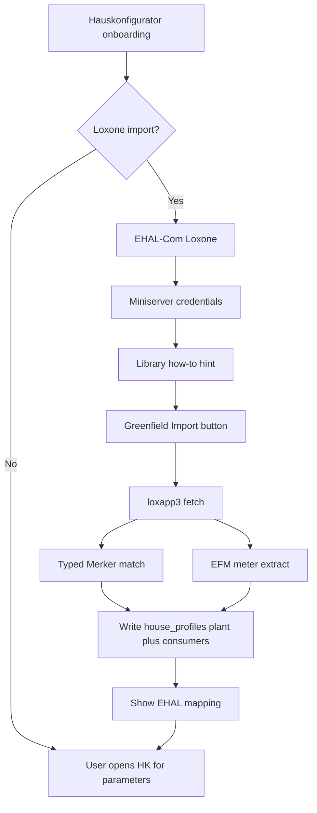
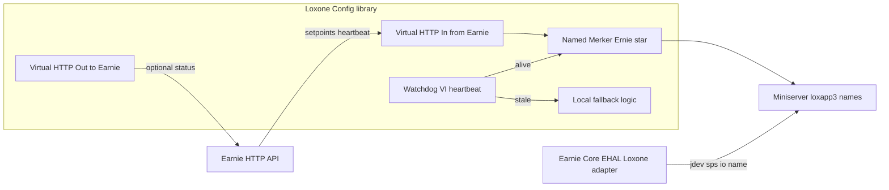

# 2.4.n Greenfield Loxone Import Workflow

## Decisions (locked)

- **Library:** Virtual HTTP **In/Out templates pointing at Earnie** (pattern **B**). Primary control mirror: **VI polls Earnie** (heartbeat + setpoints/Freigabe) into named Merker; **VO** optional Loxone→Earnie status. Earnie drafts `VO_`/`VI_` XML; you validate in Config and re-export; we commit under [`share/loxone/templates/`](share/loxone/templates/) and ship a German how-to.
- **Import typing:** Typed by **Merker / control names** matching recipe `suggested_name`s / stable prefixes; EFM Zähler still seed plant `sens_*` and consumer `flex.power_name` ([`docs/spec/efm-auto-sync-2.4.l.md`](docs/spec/efm-auto-sync-2.4.l.md)).
- **Live Earnie adapter unchanged for M1:** Core still reads/writes Miniserver via `/jdev/sps/io/{name}` on the same Bezeichnung. Pattern B adds the **Loxone-side** HTTP path to Earnie so Config can implement **Earnie-dead fallback**. Greenfield import matches those names in `loxapp3` after the library is inserted.

## Architecture

## P1 — Naming freeze + pattern B templates

Align [`share/loxone/recipes/*.json`](share/loxone/recipes/) and [`docs/referenz/loxone-signale.md`](docs/referenz/loxone-signale.md) to one **import contract**. Exact name match preferred; prefix groups for multi-signal devices:

| Device | HK target | Merker prefix / examples |
|--------|-----------|--------------------------|
| Plant ESS | `plant.ehal_bindings` | `Ernie_Batterie_SoC`, `Ernie_Batterie_Leistung`, `Ernie_Ladegrenze`, `Ernie_Entladegrenze`, `Ernie_Steuerbefehl` |
| Plant grid/PV power | plant `sens_*` | Prefer EFM node roles; optional recipe names if present |
| Heatpump | `thermal_annual` | `Ernie_WP_*` → `flex.power_name`, `flex.enable_name` |
| EV | `ev` | `Ernie_EAuto_*` / `Ernie_Wallbox_*` → EV `sens_*` / `set_*` / flex power |
| Generic flex | `generic` | `Ernie_Verbraucher_*` |
| EFM Loads | `generic` (or merge into typed if label matches) | Meter **Bezeichnung** → `flex.power_name`; residual `Rest` skipped |

Add a short machine-readable map (e.g. extend recipes or `share/loxone/greenfield_device_map.json`) used by the importer: `{prefix|exact_name → entity_kind + ehal_field}`.

### Pattern B — Virtual HTTP In/Out → Earnie

Ship device-role templates (Plant, EV, Heatpump, Generic) as Loxone Config template XML (`VI_*.xml` / `VO_*.xml` style; LoxBerry TemplateBuilder shape as reference):

| Template | Direction | Purpose |
|----------|-----------|---------|
| Virtual HTTP **In** | Earnie → Loxone | Poll Earnie for **heartbeat**, mode, and mirrored setpoints/Freigabe; feed **named Merker** that drive plant/consumers |
| Virtual HTTP **Out** | Loxone → Earnie | Push local status / request hooks if needed (optional commands); not the primary Freigabe path |
| Named Merker / Status | Shared Bezeichnung | Same `Ernie_*` names as recipes so `/jdev/sps/io/{name}` and greenfield import both resolve |

**Control path:** Earnie is source of setpoints. Loxone applies them via VI→Merker (and/or Core writes the same Merker names via `jdev`). **Earnie-dead fallback (how-to only, not Earnie Core code):** watch Virtual In heartbeat / last-update age; if stale, ignore Earnie setpoints and switch to local Config rules (e.g. Freigabe off, ESS safe mode).

**Handoff:** Earnie commits draft XML under `share/loxone/templates/VirtualIn|VirtualOut/`; you import into Config, set Earnie base URL, attach Zähler to EFM with unique stable Bezeichnung, validate, **Als Vorlage speichern** → we replace drafts with Config-exported canonical XML.

Zähler / EFM: Config checklist only (attach + naming). Do not block on embedding Meter hardware inside Virtual templates.

## P2 — Import engine

New module e.g. [`integrations/loxone_greenfield_import.py`](integrations/loxone_greenfield_import.py):

1. Reuse `fetch_loxapp3_json` / `normalize_loxapp3` / `scan_structure` ([`integrations/loxone_structure.py`](integrations/loxone_structure.py)).
2. Reuse `extract_efm_meters` + plant/consumer apply helpers ([`integrations/loxone_efm_meters.py`](integrations/loxone_efm_meters.py)).
3. New: match control names to device map → propose typed entities + `ehal_bindings`.
4. Merge rules: typed Merker device wins over duplicate EFM generic with same power meter; never invent `enable`/`setpoint` from Zähler alone.
5. Ensure a Hausprofil exists (create one minimal profile if `profiles: []`) before writing consumers.
6. Persist via existing `save_house_profiles` / `apply_entity_bindings` patterns ([`ui/ehal_loxone_mapping.py`](ui/ehal_loxone_mapping.py), [`house_config/ehal_bindings.py`](house_config/ehal_bindings.py)).

Unit tests with fixtures: extend [`tests/fixtures/loxapp3_efm_meters.json`](tests/fixtures/loxapp3_efm_meters.json) or add a greenfield fixture with Earnie_* Merkers + EFM Loads.

## P3 — Earnie UI workflow

**HK** ([`ui/pages/page_house_config.py`](ui/pages/page_house_config.py) / profile form): when `needs_planning_onboarding()` and no prior dismiss/import, show prompt: automated Loxone import for first HK structure + EHAL mapping?

- **Yes:** set `session_state` flag (`greenfield_loxone_wizard=True`), set `ehal.backend=loxone` via existing setup helper, `st.switch_page` to EHAL-Com (`url_path` `ehal-com` from [`ui/navigation.py`](ui/navigation.py)).
- **No:** dismiss flag; proceed as today.

**EHAL-Com** ([`ui/pages/page_loxone_debug.py`](ui/pages/page_loxone_debug.py)): when wizard flag set:

1. Backend already Loxone; credentials form (existing).
2. Expanded hint + link to how-to (library import + Zähler/EFM prep + fallback).
3. Primary **Greenfield importieren** button → run P2 apply → success message + “entities preset; set parameters on Hauskonfigurator” (user navigates manually).
4. Refresh/show existing mapping section ([`ui/ehal_loxone_mapping.py`](ui/ehal_loxone_mapping.py)); keep current EFM HITL section available as fallback/repair.

## P4 — Docs + packaging

German user docs (not English):

- New [`docs/einrichtung/loxone-earnie-library.md`](docs/einrichtung/loxone-earnie-library.md): copy `VI_`/`VO_` Templates into Config folders (`VirtualIn` / `VirtualOut`), set Earnie base URL, insert devices, name Zähler, hang on EFM, upload to Miniserver; **pattern B Earnie-dead fallback** (watch Virtual In heartbeat → ignore Earnie setpoints → local Loxone rules). Link from [`docs/einrichtung/loxone-anbindung.md`](docs/einrichtung/loxone-anbindung.md), [`docs/ui/ehal-com.md`](docs/ui/ehal-com.md), [`docs/README.md`](docs/README.md) TOC.
- Draft XML early under `share/loxone/templates/`; after Config validate/re-export, replace with canonical files; short README in that folder (filename prefixes `VI_` / `VO_`, folder paths).
- Backlog: rename open bullet to **2.4.n**; archive when done per [`backlog.mdc`](.cursor/rules/backlog.mdc).

## Out of scope

- Auto-publish to Loxone Library cloud.
- HA/OpenEMS greenfield (prompt text may say “later other backends”).
- Filling thermal/EV **parameters** (kWh, schedules, living area) — user sets on HK after import.
- Changing Earnie Core live transport away from Miniserver `/jdev/sps/io` in this chapter (pattern B is Loxone library + docs; Core adapter stays as today).
- Changing `version.py` (ask separately if release desired).

## Implementation order

1. Freeze naming + device map + matcher tests.
2. Draft pattern B `VI_`/`VO_` XML skeletons + German how-to (Earnie URL + watchdog fallback).
3. Import apply + profile bootstrap.
4. HK prompt + EHAL-Com wizard button.
5. Config validate/re-export → commit canonical XML; smoke on live Miniserver.
