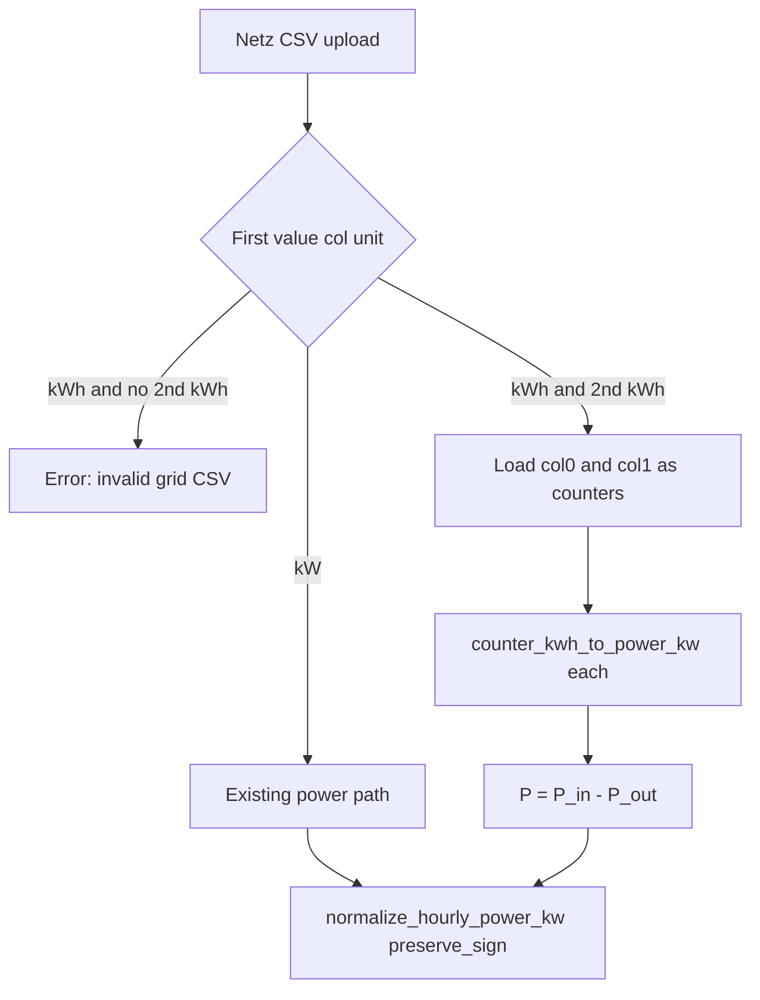

# Grid Netz-Leistung dual-kWh CSV import

## Decision (locked)

- **Semantics:** Cumulative energy counters (same as existing Energiezähler: \(P=\Delta E/\Delta t\)).
- **Scope:** Bilanz **Netz-Leistung** uploads only (`role="grid"` in [`ui/house_config_historical_csv.py`](ui/house_config_historical_csv.py)). Last/PV/Verbraucher/Batterie and Energiemonitor stay unchanged.
- **Combine rule:** \(P_\mathrm{Grid} = P_\mathrm{Bezug} - P_\mathrm{Einspeisung}\) (first kWh column = import → positive; second = export → subtract).

## Current gap

[`detect_and_load_raw_series`](house_config/consumption_csv.py) treats any `[kWh]` as a **single** cumulative counter via [`load_energy_counter_as_power_kw`](house_config/energy_counter_csv.py). Grid uploads with two Zähler columns incorrectly use one series; a lone Netz `[kWh]` is accepted instead of rejected.

## Implementation

### 1. Grid-specific loader (core)

Add helpers in [`house_config/energy_counter_csv.py`](house_config/energy_counter_csv.py) (or a small sibling if LOC grows):

- Parse header value columns after timestamp width (`Datum;Zeit;…` → width 2, or combined `timestamp` → width 1) — reuse `_resolve_timestamp_width` / frame read from [`data/loxone_csv_timeseries.py`](data/loxone_csv_timeseries.py).
- Per value column: unit from that header cell only (`[kWh]` before `[kW]` substring rule, same as today).
- New `detect_and_load_grid_raw_series(path) -> pd.Series`:
  - **First value col `[kW]`** → call existing `detect_and_load_raw_series` / power load (current behavior).
  - **First value col `[kWh]`**:
    - No second value col with `[kWh]` → clear `ValueError` (German message: Netz-CSV mit Energiezähler braucht Bezug- und Einspeise-Spalte).
    - Else load both series by column index (extend/adapt Loxone raw load to accept `value_column=`), run `counter_kwh_to_power_kw` on each, align indexes (inner join on overlapping timestamps), return `p_import - p_export`.
  - **No bracket unit on first value col** → fall back to existing `detect_and_load_raw_series` (unlabeled power / heuristic unchanged).

Reuse `counter_kwh_to_power_kw` unchanged (negative ΔE → P=0 + warn).

### 2. Wire Bilanz Netz save path

In [`_save_signed_component_csv`](ui/house_config_historical_csv.py): when `role == "grid"`, call `detect_and_load_grid_raw_series` instead of `detect_and_load_raw_series`. Battery keeps the old path.

### 3. Documentation (German)

Update [`docs/konfiguration/verbrauchs-csv.md`](docs/konfiguration/verbrauchs-csv.md):

- Under Bilanz / after Energiezähler section: Netz-Leistung may be bipolar `[kW]` **or** two cumulative counters `[kWh]` (Bezug, then Einspeisung) → one signed power series.
- Single Netz `[kWh]` column is invalid.
- Note that dual-kWh applies to Bilanz Netz only; other profiles still use single-counter import.

### 4. Tests

Extend [`tests/test_energy_counter_csv.py`](tests/test_energy_counter_csv.py) (and/or a focused new test file if cleaner):

| Case | Expect |
|------|--------|
| First value col `[kW]` (bipolar) | Same as power path |
| One value col `[kWh]` via grid loader | `ValueError` |
| Two `[kWh]` cols | Combined \(P_\mathrm{in}-P_\mathrm{out}\); spot-check a few intervals |
| Non-grid single `[kWh]` via existing loader | Still works (regression) |

### 5. Backlog

After implementation + tests: move the item from `## New Bugs` to `## Bugfix Verifications Pending` in [`backlog/Backlog-Bugfixes.md`](backlog/Backlog-Bugfixes.md) (do not archive until live verification). No `version.py` change unless you approve a PATCH.

## Out of scope

- Energiemonitor multi-column mapping
- Interval (non-cumulative) kWh
- Changing Batterie / PV / Last energy import rules
