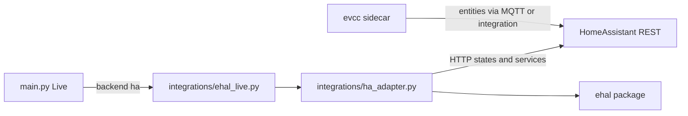

# 2.4.c — HA-EHAL + evcc under HA (Phase 2b / M1.5)

## Decisions (locked)

- **Mapping UI = full HITL (1A):** HA entity scan (`sensor` / `number` / `select`) + Streamlit mapping table → write `ehal.ha.entities` on confirm. No LLM (deferred to 2.4.f MCP parity).
- **Transport = REST-first:** poll HA states + call services (`number.set_value`, etc.). No HA WebSocket client in 2.4.c (same pattern as OpenEMS REST-only in `2.4.b`).
- **One production adapter:** Earnie talks only to Home Assistant; prefer stable HA entities that evcc exposes. Lab-only direct-evcc adapter stays **out of scope**.
- **Contract-tests:** mocked fixture parity — same EHAL telemetry/setpoints through `ehal_live` helpers yield identical Live-shaped outputs when only `ehal.backend` / hub block switches (OpenEMS vs HA). No live dual-hub plant required for CI.
- **Compliance:** HTTP only (`requests`). No HA/evcc source or libs in Earnie image; Separate Works containers.



## Config shape

Extend [`share/config/config.schema.json`](share/config/config.schema.json) (`backend` enum += `"ha"`) and add snippet [`share/config/ehal.ha.snippet.json`](share/config/ehal.ha.snippet.json):

```json
{
  "ehal": {
    "backend": "ha",
    "adapter_id": "ha-home",
    "ha": {
      "base_url": "http://homeassistant:8123",
      "token": "<long-lived-access-token>",
      "entities": {
        "grid_power_active": "sensor.evcc_grid_power",
        "pv_production_active": "sensor.evcc_pv_power",
        "ess_soc": "sensor.evcc_battery_soc",
        "ess_power": "sensor.evcc_battery_power",
        "evcs_active_power": "sensor.evcc_loadpoint_1_charge_power",
        "set_ess_charge_power_limit": "number.evcc_battery_...",
        "set_ess_discharge_power_limit": "number.evcc_battery_...",
        "set_evcs_max_current": "number.evcc_loadpoint_1_max_current"
      },
      "sign": {
        "grid_power_active": "ehal",
        "ess_power": "ehal"
      }
    }
  }
}
```

Entity IDs are placeholders until lab entity names are confirmed; mapping UI writes the real IDs. Optional `sign` flags document whether the HA entity already matches EHAL (+import / +discharge) or needs negation inside the adapter.

Loader: extend [`settings/config_loaders.py`](settings/config_loaders.py) `load_ehal_params` → `EHAL_HA_BASE_URL`, `EHAL_HA_TOKEN`, `EHAL_HA_ENTITIES` (dict).

## 1. HaAdapter (mirror OpenEMS)

New [`integrations/ha_adapter.py`](integrations/ha_adapter.py):

| Method | Behavior |
|--------|----------|
| `HaConfig` | `base_url`, `token`, `adapter_id`, `entities` map, optional sign flips, `timeout_sec` |
| `list_mappable_entities()` | `GET /api/states` → filter domains `sensor`/`number`/`select` (id, state, unit, friendly_name) for mapping UI |
| `read_telemetry()` | `GET /api/states/{entity_id}` per mapped field; normalize units (W/%) and signs → validated `EhalTelemetry` |
| `write_setpoints()` | For each present setpoint field: resolve entity domain → `POST /api/services/...` (`number.set_value` for `number`; document `select`/`input_number` if needed); omit = leave unchanged |
| `capabilities()` / degrade | Same as OpenEMS: flip `supports_ess_write` / `supports_evcs_current` on write failure; emit validated `EhalWriteError` (do not raise into MILP) |

No HA Python SDK — raw `requests` + Bearer token.

## 2. Live façade generalization

Refactor [`integrations/ehal_live.py`](integrations/ehal_live.py) so OpenEMS is not the only non-Loxone path:

- `is_ehal_network_backend()` / `is_ha_backend()` alongside `is_openems_backend()`
- Shared read/write helpers call the active adapter (`get_openems_adapter()` vs `get_ha_adapter()`)
- Keep Live-shaped returns (kW, +battery = charge) unchanged
- [`main.py`](main.py) and UI debug: treat HA like OpenEMS (skip Loxone flex I/O; show write-error banner)

Also update [`config`](config.py) helpers (`is_ehal_openems_backend` → generalize or add `is_ehal_ha_backend`) and [`ui/loxone_debug.py`](ui/loxone_debug.py) banners.

## 3. Reference Compose A2

New [`docker/compose/ha-lab.yml`](docker/compose/ha-lab.yml):

- Services: **`earnie`** (same Dockerfile pattern as openems-lab; UI port e.g. `8504`), **`homeassistant`**, **`evcc`**
- Host mounts: `ha_lab/config` + `ha_lab/runtime` for Earnie; HA config dir; evcc `evcc.yaml`
- `EARNIE_VERIFY_LOXONE_ON_START=0`; Earnie reaches HA at `http://homeassistant:8123`
- Pin image tags once known-good; document first-boot (create LLAT, enable evcc→HA entity exposure)
- Lab bring-up notes in English spec [`docs/spec/ha-lab-setup.md`](docs/spec/ha-lab-setup.md) (mirror openems-lab-setup)

evcc config in lab: **Earnie mode** — no smart cost / surplus planner; loadpoint / battery writable via HA entities only.

## 4. Entity → EHAL mapping UI (HITL)

New Streamlit section (prefer extend [`ui/pages/page_loxone_debug.py`](ui/pages/page_loxone_debug.py) or small `ui/ehal_ha_mapping.py` linked from Dev/Config when `backend` can be `ha`):

1. Connection fields: base URL + token (or read from config)
2. **Scan** → table of candidate entities
3. Per EHAL M1 field: selectbox of scanned entities (required vs optional per [`docs/spec/ehal.md`](docs/spec/ehal.md))
4. Preview current state / unit
5. **Confirm** → persist `ehal.ha.entities` into house `config.json` (reuse existing config save patterns; follow streamlit-ui-state skill for select freshness)
6. Optional “test read telemetry” / “test write dry-check” buttons

No LLM suggestions in this chapter.

## 5. Optimizer exclusivity + Modbus docs

German user docs (new):

- [`docs/einrichtung/ha-evcc.md`](docs/einrichtung/ha-evcc.md) — Path **A2** (Compose default) vs **B** (existing HA + mapping wizard; evcc optional)
- Checklist: disable evcc smart cost / spot charge planning; no competing HA automations on same setpoints; Earnie owns 48h prices
- **Modbus rule:** exactly one writing southbound owner per physical bus/device (typically evcc)
- TOC: [`docs/README.md`](docs/README.md)

English: extend [`docs/spec/ehal.md`](docs/spec/ehal.md) HA adapter notes; mark HA out-of-scope section done for 2.4.c REST path.

## 6. Tests

| Suite | Focus |
|-------|--------|
| `tests/test_ha_adapter.py` | Sign/unit mapping; REST state read; service write; 401/403 → capability degrade + write_error shape (mocked `requests`) |
| Extend `tests/test_ehal_live.py` | HA backend routes SoC/power/ESS/EVCS like OpenEMS |
| `tests/test_ehal_contract_openems_ha.py` | Fixed fixture telemetry → identical `read_live_power_kw` / setpoint payloads for both adapters when configs only differ by backend block |

## 7. Out of scope (explicit)

- HA WebSocket state subscription
- Direct evcc REST/MQTT adapter
- LLM-assisted mapping (2.5)
- Loxone-EHAL extraction (2.4.e)
- Expanding M1 EHAL fields (HP/flex/`target_soc`)
- `version.py` bump (ask separately if a community alpha is desired)

## Implementation order

1. Schema + loader + snippet  
2. `ha_adapter.py` + unit tests  
3. `ehal_live` / `main` / debug UI generalization  
4. Mapping UI  
5. Compose + lab setup docs  
6. German A2/B docs + exclusivity checklist  
7. Contract-tests  
8. After lab acceptance: archive **2.4.c** → [`backlog/Backlog-Erledigt.md`](backlog/Backlog-Erledigt.md) (session-abschluss / user request)
