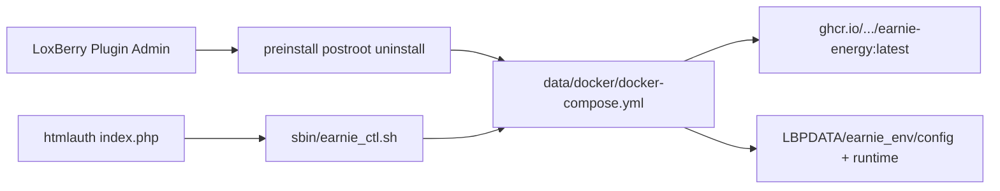

# 2.4.d — LoxBerry plugin Scope A MVP

## Decisions (locked)

- **Home:** [`packaging/loxberry/`](packaging/loxberry/) inside Energy-Optimizer
- **Image:** always `ghcr.io/jochentcc/earnie-energy:latest` (same as [`docker/compose/loxberry_productive.yml`](docker/compose/loxberry_productive.yml)); plugin SemVer independent (start at `0.1.0`)
- **Uninstall:** stop/remove container; **keep** `$LBPDATA/.../earnie_env/{config,runtime}`; document manual wipe
- **Out of scope:** alpha channel, HA/evcc/OpenEMS sidecars, Miniserver `.env` prefill, Streamlit iframe, native host install

## Architecture



Pattern: [UniFi Controller NG](https://github.com/blacksun80/LoxBerry-Plugin-UniFi-Controller-NG) — systemd oneshot + `docker compose`, PHP UI, secrets in `$LBPCONFIG`.

## Plugin tree

```text
packaging/loxberry/
  plugin.cfg                 # NAME=earnie FOLDER=earnie LB_MINIMUM=4.0.0 ARCHITECTURE=aarch64
  release.cfg / prerelease.cfg
  preinstall.sh              # docker + compose probe; exit 2 if missing
  preroot.sh / postroot.sh   # stop unit; install unit + compose up -d
  preupgrade.sh / postupgrade.sh  # backup/restore $LBPCONFIG env
  postinstall.sh             # mkdir defaults as loxberry
  uninstall/uninstall.sh     # compose down; leave earnie_env
  data/docker/
    docker-compose.yml       # adapted productive compose; REPLACELBP* bind mounts
    earnie.service           # Requires=docker.service; WorkingDirectory=…/docker
  sbin/earnie_ctl.sh         # start|stop|restart|status|pull (passwordless sudo)
  bin/healthcheck            # LB healthcheck: container running → 5/3
  webfrontend/htmlauth/index.php
  templates/ + lang/language_de.ini (+ en)
  icons/icon.svg
```

### Compose adaptation

Ship a plugin-local compose derived from productive YAML:

- `image: ghcr.io/jochentcc/earnie-energy:latest`
- Port `8501:8501`, same env/command as productive
- Volumes → `REPLACELBPDATADIR/earnie_env/config` and `…/runtime` (not `./earnie_env` under `/opt`)
- `name:` / `container_name:` stay `earnie-productive` so manual `/opt` installs and plugin do not collide if both used (document: pick one path)

### Lifecycle

| Hook | Behavior |
|------|----------|
| `preinstall` | `docker` + `docker compose version` + socket check → hard fail with German message pointing to Docker plugin |
| `postinstall` | `mkdir -p` data dirs; default config stub if missing |
| `postroot` | install/enable systemd unit; `docker compose pull && up -d` |
| upgrade | `preroot` stop → backup config → install → restore → `postroot` up (volumes untouched) |
| uninstall | stop/disable unit; `compose down`; **do not** `rm -rf` earnie_env |

Keep-alive: systemd + compose `restart: unless-stopped`; `bin/healthcheck` as secondary signal (no busy cron).

### Minimal WebUI

PHP page (LB4 Design System): container status, Start/Stop/Restart, link `http://<host>:8501`, show plugin `VERSION` + running image id/tag (`docker inspect`), short Go/No-Go reminder (RAM ≥4 GB, SSD).

### AutoUpdate / ZIP

- `plugin.cfg` `[AUTOUPDATE]` → raw GitHub URLs for `packaging/loxberry/release.cfg` (+ prerelease)
- `release.cfg` `ARCHIVEURL`: GitHub Release asset or `…/archive/refs/tags/loxberry-plugin-v0.1.0.zip` once a tag exists; until first publish, document **manual ZIP** of `packaging/loxberry/` for Plugin Admin install
- Small helper or CONTRIBUTING note: how to zip (exclude junk) and bump `VERSION` in `plugin.cfg` + `release.cfg` together
- Docs: plugin update ≠ image update — UI/ctl `pull` refreshes `:latest`

## German user docs

- New page [`docs/einrichtung/loxberry-plugin.md`](docs/einrichtung/loxberry-plugin.md): ZIP install, Docker prerequisite, data paths under LB plugin dirs, UI, upgrade/uninstall policy, Go/No-Go, contrast with manual compose in [`docs/einrichtung/container.md`](docs/einrichtung/container.md)
- TOC link in [`docs/README.md`](docs/README.md); short cross-link from LoxBerry section in `container.md`
- Touch [`docs/referenz/streamlit-ports.md`](docs/referenz/streamlit-ports.md) only if plugin path needs a one-line note

## Verification (dev-side; full LB hardware may be later)

- Dry-run review of hook scripts / compose REPLACE tags
- Optional: package ZIP and install on LB 4.x when available — acceptance from backlog (fresh install → UI :8501; upgrade preserves config/runtime)

## Explicit non-goals this chapter

Do not fix alpha `earnie_env` vs `earnie_env_alpha` mount drift in `loxberry-alpha.yml` (channel switcher out of scope). Do not bump `version.py`.
