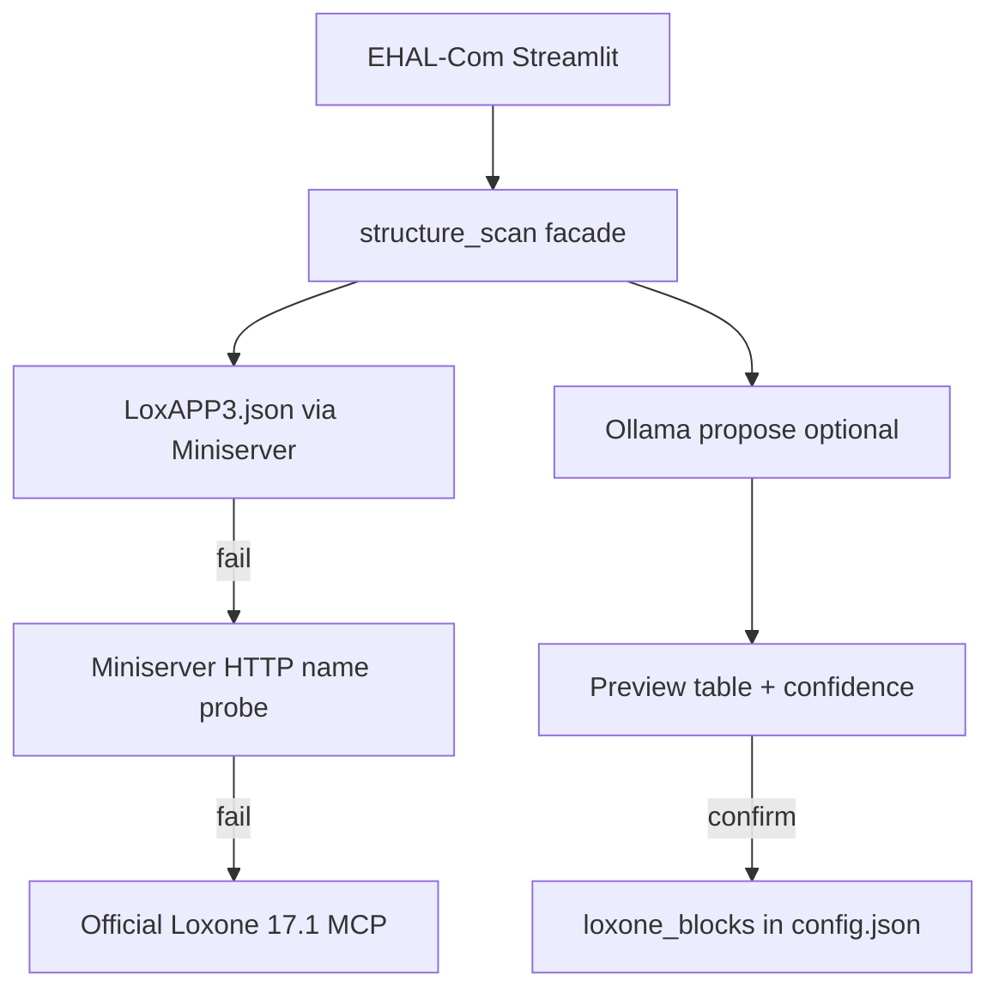

# 2.4.f — Loxone one-click mapping + structure research

**Prerequisite:** `2.4.e` finished (Loxone-EHAL adapter + `ehal.backend=loxone`).  
**Strategic source:** Earnie-Projekt `Entwicklungs-Plan-Earnie-cons.md` §3.1.  
**UI pattern:** [`ui/ehal_ha_mapping.py`](ui/ehal_ha_mapping.py) (HITL scan → EHAL fields → confirm).  
**Persist path:** proposals shown as EHAL fields; on confirm write flat [`loxone_blocks`](ui/loxone_marker_forms.py) (same keys Live already uses) via `save_main_config` + `reset_adapter_cache()`.

## Ollama vs Earnie release (locked)

| Layer | Decision |
|-------|----------|
| Feature in Earnie | Yes — optional “KI-Vorschlag” on EHAL-Com |
| Bundled in Earnie image / LoxBerry ZIP | **No** — Ollama stays a separate local service (HTTP `http://host:11434`) |
| Without Ollama | HITL still works: structure scan + manual dropdowns (HA parity); LLM button disabled with short German hint |
| Docs | Document optional Ollama install (or optional compose sidecar later); not a hard dependency of `2.4.0` |

Cloud LLM providers stay out of MVP.

## Architecture

## Phase 1 — Structure sources (lab-ordered)

New module [`integrations/loxone_structure.py`](integrations/loxone_structure.py) (thin; no MCP SDK until Phase 1c needs it).

**1a — `LoxAPP3.json` (preferred)**  
- Authenticated fetch of Miniserver structure (`LoxAPP3.json` / controls tree).  
- Normalize to a flat list: `{name, uuid?, type?, room?, category?}` suitable for marker-name mapping (Earnie Live still addresses **names**, not UUIDs).  
- Unit-test with a small fixture JSON (no live Miniserver in CI).

**1b — Miniserver HTTP fallback**  
- If structure file unavailable: use existing credentials + targeted `/jdev/sps/io/...` / known-name probes only where useful; do **not** invent a full tree from HTTP alone.  
- Report capability: `structure_complete=false` so UI can show “partial / manual”.

**1c — Official Loxone Config 17.1 MCP plugin**  
- After 1a/1b are coded and lab-tested, probe the Network-Periphery MCP endpoint (tool/resource discovery).  
- Implement MCP client only if the plugin exposes a usable structure listing; otherwise document gap and keep 1a as production path.  
- No community MCP servers (Smarteon/avrabe) in this chapter.

**Acceptance (Phase 1):** On a lab Miniserver, at least one source returns a usable control/marker name list; UI shows which source won.

## Phase 2 — LLM propose (Ollama) + HITL UI

**Mapper:** [`integrations/loxone_ehal_mapping.py`](integrations/loxone_ehal_mapping.py)  
- Target fields = M1 EHAL surface (same labels as HA):  
  `grid_power_active`, `pv_production_active`, `ess_soc`, `ess_power`, `evcs_active_power`,  
  `set_ess_charge_power_limit`, `set_ess_discharge_power_limit`, `set_evcs_max_current`  
- Translate EHAL field → `loxone_blocks` keys on save (`soc_name`, `pv_power_name`, …). EVCS fields remain optional / may stay empty (`supports_evcs_current=false` today).  
- Optional extras row group (non-EHAL): `target_soc_name`, `control_cmd_name` — propose but clearly labeled “Loxone-Extras”.

**Ollama:** HTTP `POST /api/chat` (or generate) with structured JSON response `{field, marker_name, confidence}`; model name configurable (default e.g. `llama3.2`); timeout + “Ollama unreachable” degrade to empty proposals.

**UI:** [`ui/ehal_loxone_mapping.py`](ui/ehal_loxone_mapping.py) + hook on [`ui/pages/page_loxone_debug.py`](ui/pages/page_loxone_debug.py) when backend is Loxone (mirror HA section).  
- Buttons: Struktur scannen → optional KI-Vorschlag → table (field / proposed name / confidence / override select) → Speichern.  
- Save writes `loxone_blocks` only after confirm; then `reset_adapter_cache()`.

**Tests:** fixture structure → deterministic propose (mock Ollama) → `loxone_blocks` dict; UI logic covered lightly without Streamlit runtime if helpers are pure.

## Phase 3 — Docs + backlog follow-up

- German user doc: extend [`docs/ui/ehal-com.md`](docs/ui/ehal-com.md) (and TOC if needed) — one-click mapping, Ollama optional, structure source status.  
- Spec note in [`docs/spec/ehal.md`](docs/spec/ehal.md): onboarding helper, not live I/O.  
- **EFM interpretation C:** do **not** implement in this chapter. After Phase 1 works, add a short research note (can reopen structure tree for meter roles) and keep backlog bullet as follow-up under `2.4.f` or a successor item — manual blueprint remains [`.cursor/plans/energieflussmonitor_hausprofil_blueprint_a.plan.md`](.cursor/plans/energieflussmonitor_hausprofil_blueprint_a.plan.md).

## Out of scope

- Bundling Ollama in Earnie Docker / LoxBerry plugin  
- Community MCP servers  
- Nested Hausprofil / Verteiler (`2.+1`)  
- Device-role template library (`2.4.g`)  
- Dual-write `ehal.loxone.entities` nesting (keep flat `loxone_blocks` for Live compatibility)  
- EFM auto-create consumers (after structure path is proven)

## Implementation order

1. Structure facade + LoxAPP3 fetch + fixture tests  
2. HITL UI without LLM (scan + manual map + save) — usable immediately  
3. Ollama propose layer  
4. Official 17.1 MCP probe / optional client  
5. Docs; EFM C remains deferred note
