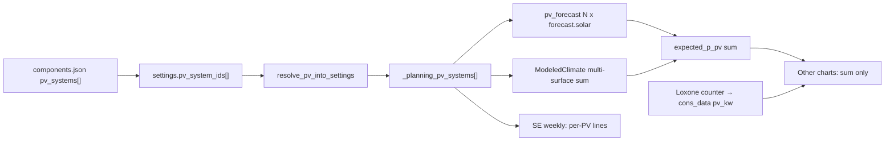

# Multi-PV Scenarios (Version 2.+1)

## Decisions (locked)

- **Binding:** Scenario settings use `pv_system_ids: string[]` (multi-select from `components.json` → `pv_systems[]`).
- **Scope:** Live + Scenario Explorer / backtesting share the same resolution path.
- **Loxone:** No change — power/counter remain a single plant sum (already matches backlog).
- **Charts:** Weekly SE charts → one line per PV; all other charts → summed PV only.
- **Legacy:** On resolve/load, `pv_system_id` (string) normalizes to `pv_system_ids: [id]` or `[]` if empty; saves write `pv_system_ids` only.

## Architecture

**Resolved shape** (in [`house_config/entity_resolution.py`](house_config/entity_resolution.py)):

- Inject `_planning_pv_systems: [{id, label, pv_kwp, pv_tilt, pv_azimuth}, ...]`
- Keep `pv_kwp` = **sum of kWp** for metrics / fingerprints / empty-check
- Do **not** rely on a single `pv_tilt`/`pv_azimuth` when `len > 1` (production always loops systems)

## Implementation slices

### 1. Schema + resolution

- Update [`config/backtesting_scenarios.schema.json`](config/backtesting_scenarios.schema.json): `pv_system_ids` array of strings; keep `pv_system_id` as deprecated optional for read-compat (or document migration-only).
- Update [`config/components.schema.json`](config/components.schema.json) description (scenario picks many IDs).
- Rewrite `resolve_pv_into_settings` to accept both keys → `_planning_pv_systems` + summed `pv_kwp`.
- Wire through [`house_config/scenario_resolution.py`](house_config/scenario_resolution.py), [`ui/house_config_io.py`](ui/house_config_io.py) (`get_live_scenario_refs` / `save_live_scenario_refs`), startup checks ([`scripts/startup_checks.py`](scripts/startup_checks.py)).
- Migrate example/fixtures: [`config/backtesting_scenarios.example.json`](config/backtesting_scenarios.example.json), tests fixtures.

### 2. Production paths (sum)

**Open-Meteo / backtesting** — [`data/modeled_climate.py`](data/modeled_climate.py):

- Extend `ModeledClimateContext` with `pv_systems: list[{id, label, surface, kwp}]` (replace single `pv_surface`+`pv_kwp` for production).
- `from_scenario`: build list from `_planning_pv_systems` (fallback: legacy flat fields → one synthetic system).
- `pv_kw_at` / `pv_kw_for_slots`: sum over systems; add `pv_kw_by_system_for_slots()` for charts.
- Include all PV surfaces in Open-Meteo bundle surface list (dedupe tilt/azimuth keys as today).

**Live forecast** — [`data/pv_forecast.py`](data/pv_forecast.py):

- Fetch one forecast.solar URL per system (existing cache key already URL-based); sum vectors for callers that need aggregate.
- Expose optional per-system series for weekly UI if needed later; MILP keeps sum only.

**MILP / matrix:** Keep single `expected_p_pv` as sum — no per-PV MILP variables.

**Historical cons_data:** Unchanged single `pv_kw` (Loxone sum). Weekly charts with only cons_data show one PV line (no per-array split).

### 3. UI

- **Scenario Editor** ([`ui/pages/page_scenario_editor.py`](ui/pages/page_scenario_editor.py)) + helpers ([`ui/scenario_form_helpers.py`](ui/scenario_form_helpers.py)): replace PV selectbox with `st.multiselect`; seed/save `pv_system_ids`.
- **Live-Konfiguration** ([`ui/config_forms.py`](ui/config_forms.py)): same multiselect; metrics show sum kWp (+ caption listing selected systems).
- **Hauskonfigurator PV tab** ([`ui/planning_pv_form.py`](ui/planning_pv_form.py)): keep catalog editor; add **Entfernen** (mirror consumer remove) so multi-PV setup matches backlog “similar to consumers” UX. No change to entity location (still `components.json`).

### 4. Weekly Scenario Explorer charts

- Extend [`ui/consumption_display/types.py`](ui/consumption_display/types.py) `ConsumptionSeriesBundle` with optional `pv_by_system: dict[str, list[float]]` + labels.
- Build per-PV series in modeled SE path (via `ModeledClimateContext.pv_kw_by_system_for_slots`); `bundle.pv` remains the sum.
- [`ui/consumption_display/charts.py`](ui/consumption_display/charts.py) `week_timeseries_chart`: if `pv_by_system` present, draw one trace per system; else single `PV-Erzeugung`.
- Monthly / cost / flow / backtesting Chart1–2: continue using sum only.

### 5. Docs + tests

- German user docs: [`docs/konfiguration/batterie-pv.md`](docs/konfiguration/batterie-pv.md), scenario docs if they mention `pv_system_id`.
- Tests: extend [`tests/test_house_config.py`](tests/test_house_config.py) (resolve multi + legacy), [`tests/test_modeled_climate.py`](tests/test_modeled_climate.py) (sum of two surfaces), new forecast unit test with mocked multi-fetch, UI/helpers tests for multiselect save shape.

## Explicit non-goals

- Per-PV Loxone markers or cons_data columns
- Per-PV MILP decision variables
- Moving PV list onto house profile (`consumers[]`-style ownership)
- Automatic `version.py` bump (ask when feature is done / MINOR assigned)

## Suggested work order

1. Resolution + schema + fixtures  
2. `ModeledClimateContext` multi-sum + tests  
3. `pv_forecast` multi-sum  
4. Scenario Editor + Live UI  
5. Weekly chart per-PV  
6. Hauskonfigurator remove-PV  
7. Docs + fixture migration of real `config/backtesting_scenarios.json` entries
