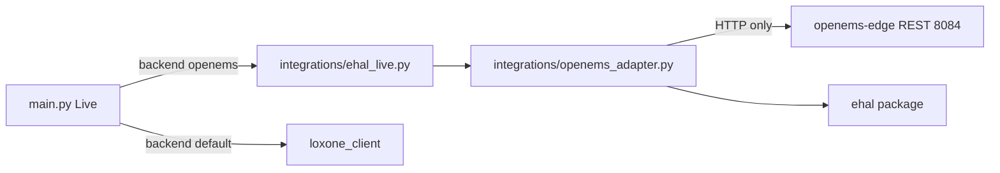

# 2.4.b — OpenEMS EHAL prototype (Phase 2 / M1)

## Decisions (locked)

- **Live depth = thin M1 bridge:** under `ehal.backend=openems`, Live swaps only SOC / live power / ESS limit writes (+ new EVCS Amp setpoint). Flex consumers, `target_soc`, `control_cmd`, PV-counter, FTP stay Loxone-only / unused in this mode. Default (missing backend) remains today’s Loxone path until **2.5.a**.
- **EVCS = lab now:** install OpenEMS **Simulator Evcs** (`evcs0`) and exercise `evcs_active_power` + `set_evcs_max_current` in acceptance.
- **Transport = REST first** on Edge `:8084` (already verified). No OpenEMS WebSocket client required for M1 acceptance; JSON-RPC/WS remains optional later.
- **Compliance:** HTTP client only (`urllib`/`requests` already in stack). No OpenEMS jars, source, or Python bindings in Earnie repos.
- **Hub mapping for EVCS Amps:** EHAL stays **A**; OpenEMS ManagedEvcs write path is typically **`SetChargePowerLimit` (W)**. Adapter converts A→W with house-profile voltage/phases via [`settings/ev_power.py`](settings/ev_power.py). If Simulator Evcs exposes a writable MaxCurrent channel, prefer that; otherwise document W conversion in the mapping table.



## 1. Lab platform (Pi / host `192.168.178.34`)

Extend [`docs/spec/openems-testing-platform-todo.md`](docs/spec/openems-testing-platform-todo.md) §3.4:

- Install **Simulator Evcs** (ID `evcs0`); note exact factory name from UI/Felix.
- Sanity: read charge power; write limit (MaxCurrent **or** SetChargePowerLimit) via REST as admin.
- Complete OEM negativtest checklist item: swap to `Controller.Api.Rest.ReadOnly` (or guest write denial) → expect non-2xx; adapter must degrade.
- Pin `openems/edge` + `openems/ui-edge` image tags once known-good.

## 2. Reference Compose

Add [`docker/compose/openems-lab.yml`](docker/compose/openems-lab.yml):

- Service name **`earnie`** (same pattern as greenfield/dev). Backlog “`earnie-core`” = this single Streamlit+`main` container — do not invent a second core service.
- Patterned on [`docker/compose/greenfield.yml`](docker/compose/greenfield.yml) (`EARNIE_VERIFY_LOXONE_ON_START=0`, config/runtime volumes, UI port e.g. `8503`).
- `openems-edge` + `openems-ui` from the platform TODO (ports `8080`/`8084`/`8085` / `8088`; REST **8084 on edge only**).
- Earnie env: OpenEMS REST base URL pointing at service name `http://openems-edge:8084` (or host LAN IP when Edge runs outside Compose).
- Do **not** bake OpenEMS config/jars into the Earnie image — volumes only on the Edge service.

## 3. OpenEMS adapter (network-only)

New module **[`integrations/openems_adapter.py`](integrations/openems_adapter.py)** (keep hub I/O out of `ehal/`):

| Responsibility | Detail |
|----------------|--------|
| REST client | Basic auth; `GET/POST …/rest/channel/{component}/{channel}` |
| `read_telemetry()` | `_sum/GridActivePower` (negate OpenEMS sell-to-grid → EHAL `+` import), `_sum/ProductionActivePower`, `ess0/Soc` or `_sum/EssSoc`, optional `ess0/ActivePower`, `evcs0` charge power |
| `write_setpoints()` | Map charge/discharge **magnitudes (W)** → `SetActivePowerGreaterOrEquals` / `SetActivePowerLessOrEquals` (verified lab channels); EVCS A→W then write limit channel |
| `capabilities()` | Start `supports_ess_write` / `supports_evcs_current` true when channels configured; flip false on write failure |
| Degrade | On failed write: log, emit `EhalWriteError`, validate via `ehal.validate_*`, do not raise into MILP |

Channel map stays the frozen table in [`docs/spec/ehal.md`](docs/spec/ehal.md) / platform TODO.

## 4. Thin Live bridge + config

New **[`integrations/ehal_live.py`](integrations/ehal_live.py)**:

- Factory: if `ehal.backend == "openems"` → OpenEMS adapter; else `None` (legacy Loxone).
- Helpers Live can call without importing OpenEMS types:
  - `read_ess_soc()` → `%`
  - `read_live_power_kw()` → dict shaped like today’s `fetch_loxone_live_power` keys (`pv` / `grid` / `battery` / `house`) with **W→kW** and sign normalize at the boundary
  - `write_ess_limits_from_huawei(mode, target_power_kw)` → use existing `map_huawei_modbus_values` for charge/discharge kW legs only → EHAL W limits (skip `target_soc` / `control_cmd`)
  - `write_evcs_max_current_from_consumers(consumer_powers, …)` → first configured EV → kW→A via inverse of `ampere_to_kw`

Config (document in example / lab overlay; load in [`settings/config_loaders.py`](settings/config_loaders.py)):

```json
"ehal": {
  "backend": "openems",
  "adapter_id": "openems-lab",
  "openems": {
    "base_url": "http://openems-edge:8084",
    "username": "x",
    "password": "admin",
    "ess_component": "ess0",
    "evcs_component": "evcs0"
  }
}
```

Wire **[`main.py`](main.py)** at the three existing hooks (~SOC read, `fetch_loxone_live_power`, `send_huawei_modbus_states`) plus the new EVCS write after MILP. When backend is OpenEMS: skip `send_flexible_consumer_states` / flex live reads that would hard-fail without Loxone (use empty flex maps). Reuse `is_loxone_silent_mode()` as the southbound write gate for OpenEMS as well (document in a one-line log message).

Missing `ess_soc` → abort Live (same as today).

## 5. Write-error UI hint

- Persist last `EhalWriteError` to `runtime/ehal_write_error.json` (clear on successful write of that family).
- Reuse the existing write-failure pattern from Loxone-Kommunikation ([`ui/loxone_debug.py`](ui/loxone_debug.py) / [`ui/pages/page_loxone_debug.py`](ui/pages/page_loxone_debug.py)): add an EHAL write-error banner there (and a one-line warning on [`ui/pages/page_daemon.py`](ui/pages/page_daemon.py) if cheap). Cockpit does not need a new alert surface for M1.

## 6. Tests

- Unit tests with mocked HTTP: sign flip, W/kW, ESS limit mapping, EVCS A→W, 403 → capabilities false + write_error shape (`tests/test_openems_adapter.py`, `tests/test_ehal_live.py`).
- No live hit to `192.168.178.34` in CI; optional `@pytest.mark.integration` gated by env for manual lab runs.

## 7. Docs / backlog hygiene

- Update platform TODO §4–5 checkboxes and EVCS channel notes; point Compose path at `docker/compose/openems-lab.yml`.
- Short connector note in [`docs/spec/ehal.md`](docs/spec/ehal.md) “implementation notes” (REST cadence, A→W EVCS, silent gate) — no schema change.
- German user docs: only a thin pointer under `docs/einrichtung/` if Compose is meant for operators; otherwise keep lab detail in `docs/spec/` (prototype path C).
- Archive **2.4.b** to [`backlog/Backlog-Erledigt.md`](backlog/Backlog-Erledigt.md) only after lab acceptance.

## Explicit non-goals

- HA/evcc (**2.4.c**), Loxone-EHAL extraction (**2.5.a**), flex-consumer / HP EHAL fields, MQTT, `version.py` bump, WebSocket OpenEMS client.

## Acceptance

- Compose up: Earnie + OpenEMS Edge/UI; sim plant includes EVCS.
- Live with `ehal.backend=openems` reads SOC/grid/PV (and EVCS power) and writes ESS limits + EVCS current **only** via validated EHAL documents — no OpenEMS types in optimizer math.
- ReadOnly/locked write → log + capability degrade + UI hint; optimizer continues.
- Default config still uses Loxone path unchanged.
- Compliance checklist in platform TODO green (separate containers, network-only, no OpenEMS source in repo).
