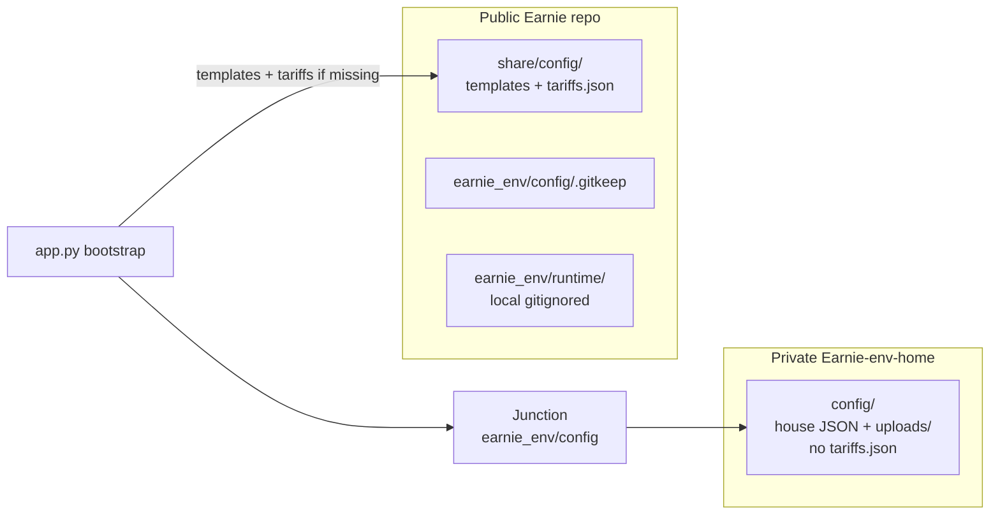

# Private earnie_env via sibling repo + history rewrite

## Decisions (locked)

- **Wiring:** sibling private repo + Windows **directory junction** on `earnie_env/config`
- **Private contents:** site pack — `config.json`, `backtesting_scenarios.json`, sidecars (`house_profiles`, `components`, `deviation_rules`), `uploads/` — **not** `tariffs.json`
- **Public `tariffs.json`:** stays in the public Earnie repo (canonical path [`share/config/tariffs.json`](share/config/tariffs.json)); seeded into the local/junctioned config dir by bootstrap when missing
- **History:** rewrite public `Earnie` history to remove house site JSON already pushed to GitHub; **do not** scrub `tariffs.json`

## Target layout



| Location | Contents |
|----------|----------|
| Public [`share/config/`](share/config/) | Templates (`*.minimal` / `*.example` / `*.schema`) **and** the published catalog [`tariffs.json`](earnie_env/config/tariffs.json) (moved here) |
| Public [`earnie_env/config/.gitkeep`](earnie_env/config/.gitkeep) | Empty config dir marker for fresh clones / Cloud |
| Private `Earnie-env-home/config/` | House site pack (no `.env`, **no** `tariffs.json`) |
| Local junction | `earnie_env\config` → `..\Earnie-env-home\config` |

Why `tariffs.json` under `share/config/` (not under junctioned `earnie_env/config/`): a full-directory junction replaces the config folder locally, so a publicly tracked file cannot live only in `earnie_env/config/`. Publishing the catalog in `share/config/` matches Docker’s existing bundled-template pattern and keeps Community Cloud / fresh clones able to seed tariffs without the private repo.

Bootstrap already prefers files in the config dir and falls back to [`bundled_config_dir()` → `share/config`](runtime_store/persist_paths.py). **Change:** when creating a missing `tariffs.json`, copy from `share/config/tariffs.json` (full catalog) if present; only fall back to `tariffs.minimal.json` if the full catalog is absent.

**Publishing tariff edits:** UI/auto-save writes `earnie_env/config/tariffs.json` (junctioned, local). To update the public catalog, copy that file to `share/config/tariffs.json` and commit in Earnie (document in private-env doc).

## Implementation steps

### 1. Create private repo and seed it (before touching public git)

- Create private GitHub repo **`Earnie-env-home`** (sibling of the Earnie clone, e.g. `Documents\Smarthome\Python\Earnie-env-home`).
- Layout:
  - `config/` — copy from [`earnie_env/config/`](earnie_env/config/): `config.json`, `backtesting_scenarios.json`, `house_profiles.json`, `components.json`, `deviation_rules.json`, `uploads/` (if present), `remote_backtesting.json` if present
  - **Exclude** `tariffs.json` (and tariff templates — those stay public)
  - `.gitignore`: `.env`, `*.pyc`; optionally ignore a local `tariffs.json` if one is seeded into the private config dir so it is never committed privately
  - Short `README.md`: purpose, junction command, “never make public”, note that tariffs come from public `share/config/tariffs.json`
- Initial commit + push to private remote.
- **Do not** include `earnie_env/runtime/` or `.env` in the private repo.

### 2. Relocate public templates + `tariffs.json` to `share/config/`

In the public working tree:

- Move (git mv) from `earnie_env/config/` → `share/config/`:
  - `*.minimal.json`, `*.example.json`, `*.schema.json`
  - **`tariffs.json`** (full public catalog)
  - `remote_backtesting.example.json`, `remote_backtesting.schema.json`
  - `prognosis-heating-need.py`
- Keep only `.gitkeep` under `earnie_env/config/` in the public tree.
- Update tariff bootstrap / `resolve_tariffs_*` so missing site `tariffs.json` is seeded from `share/config/tariffs.json` first, then minimal.
- Update [`docker/Dockerfile`](docker/Dockerfile): stop copying templates from `earnie_env/config/…`; rely on committed `share/config/` after `COPY . .` (still copy `local_settings.example.json` + `.env.example` into `share/config` if needed).
- Point validate-tariffs / container docs at `share/config/tariffs.json` where they currently cite `earnie_env/config/tariffs.json` as the bundled catalog.
- Fix doc links for examples/schemas → `share/config/…` ([`docs/konfiguration/ueberblick.md`](docs/konfiguration/ueberblick.md), [`docs/einrichtung/container.md`](docs/einrichtung/container.md)).

### 3. Ignore site data under `earnie_env/config/`

Replace the partial ignores in [`.gitignore`](.gitignore) with:

```gitignore
earnie_env/config/*
!earnie_env/config/.gitkeep
```

Keep existing `earnie_env/runtime/*` rules and root `.env` ignores. Site `tariffs.json` under the junction remains local-only; the **published** catalog is `share/config/tariffs.json`.

`git rm --cached` (and stop tracking under `earnie_env/config/`):

- `earnie_env/config/house_profiles.json`
- `earnie_env/config/components.json`
- `earnie_env/config/deviation_rules.json`

Do **not** delete `tariffs.json` from the public tree — **move** it to `share/config/tariffs.json` (step 2).

### 4. Junction setup (local + helper script)

After private repo is seeded and templates/`tariffs.json` moved:

1. Ensure private `config/` has the house site pack (no `tariffs.json` required in private git).
2. Remove the public working-tree `earnie_env\config` directory (templates/tariffs already in `share/config/`; house files live in private repo).
3. Create junction:

```powershell
cmd /c mklink /J "C:\Users\joche\Documents\Smarthome\Python\Energy-Optimizer\earnie_env\config" "C:\Users\joche\Documents\Smarthome\Python\Earnie-env-home\config"
```

4. Add [`scripts/link_private_env.ps1`](scripts/link_private_env.ps1) that:
   - takes `-PrivateRepoRoot` (default sibling `..\Earnie-env-home`)
   - refuses to run if target missing
   - creates `earnie_env\runtime` if needed
   - creates/replaces the junction safely
   - if `earnie_env\config\tariffs.json` is missing after linking, copies from `share\config\tariffs.json`

Docker Compose mounts stay `./earnie_env/config` — junction is transparent.

### 5. Docs + backlog

- New German user-doc: [`docs/einrichtung/private-env.md`](docs/einrichtung/private-env.md) — private repo, junction, public `share/config/tariffs.json`, Cloud/bootstrap without private data; link from [`docs/README.md`](docs/README.md) and [`docs/einrichtung/betrieb.md`](docs/einrichtung/betrieb.md).
- Update [`docs/konfiguration/speichern-laden.md`](docs/konfiguration/speichern-laden.md): house files are local/private; tariff catalog is public under `share/config/`; ZIP remains the portable transfer tool.
- Clarify Community Cloud bullet in [`backlog/Backlog.md`](backlog/Backlog.md) once this split is done.

### 6. Git history rewrite (public `Earnie` only)

**Preconditions:** private repo has the house site pack; public commit has templates + `tariffs.json` under `share/config/`; house site files untracked under `earnie_env/config/`; backup clone exists.

1. Use `git filter-repo` on a fresh mirror clone.
2. Remove from **all** history:
   - `earnie_env/config/house_profiles.json`
   - `earnie_env/config/components.json`
   - `earnie_env/config/deviation_rules.json`
   - legacy house paths if present: `config/house_profiles.json`, `config/components.json`, `config/deviation_rules.json`, and committed `config.json` / `backtesting_scenarios.json` under those trees (not `tests/fixtures/`)
3. **Do not** remove `tariffs.json` / `earnie_env/config/tariffs.json` / `share/config/tariffs.json` from history (catalog stays public; moving path in a normal commit is enough going forward).
4. Verify scrubbed paths are gone; confirm `share/config/tariffs.json` (or historical tariff paths) and fixtures remain.
5. Force-push to `origin` (**explicit user confirmation at execute time**).
6. Re-clone or hard-reset other local checkouts.

**Out of scope for rewrite:** forks, old GHCR layers from past `COPY . .` builds that may have included house JSON.

### 7. Verification

- Public `git ls-files earnie_env/config` → only `.gitkeep`.
- Public `git ls-files share/config` → templates **and** `tariffs.json`.
- With junction: site `config.json` loads; missing tariffs seeded from `share/config/tariffs.json`.
- Without junction (Cloud sim): empty `earnie_env/config` + `share/config` → bootstrap creates minimal house files + full tariffs from share.
- `pytest` path/bootstrap/tariff tests pass; Docker image has `/app/share/config/tariffs.json`.

## Explicit non-goals

- No submodule
- No `version.py` bump
- No change to ZIP pack format (ZIP may still include a local `tariffs.json` copy)
- No committing `.env` anywhere
- Greenfield stack (`greenfield/`, already gitignored) unchanged
- No history scrub of `tariffs.json`
