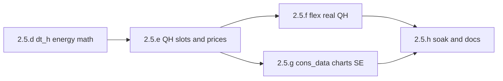

# Version 2.5 — Full QH MILP (2.5.d–h)

## Scope decision

Plan **all** of **2.5.d–h** in one roadmap (shared architecture, hard ordering). Implement **one letter chapter per work slice**; merge/test after each before starting the next. Do not start **2.5.e** until **2.5.d** lands with `dt_h=1.0` parity tests.

Canonical brief: [`docs/spec/quarter-hour-slots.md`](docs/spec/quarter-hour-slots.md). Loxone write/re-opt cadence stays **15 min** ([`optimizer/schedule.py`](optimizer/schedule.py) `seconds_until_next_quarter_hour`) throughout.

## Locked design choices

| Topic | Choice |
|-------|--------|
| Slot duration | Constant `dt_h = 0.25` once matrix is QH; during **2.5.d** introduce param with callers still on hourly matrix and `dt_h=1.0` for parity |
| Hourly prices (CH, pre-2025-10, aWATTar) | **Expand**: one hourly sample → four identical QH prices |
| Native QH (AT/DE-LU post go-live) | Keep native `:00/:15/:30/:45`; stop floor-to-hour / `resample("h").mean()` |
| Live prices | Energy-Charts by zone first; aWATTar fallback + expand (mirror SE [`data/data_loader.py`](data/data_loader.py)) |
| `cons_data_hourly` | Keep hour flush/CSV; **upsample at read** (hour-floor hold). No new QH CSV in this cycle |
| `commit_hours` | Keep **wall-clock hours**; at apply: `commit_slots = int(round(commit_hours / dt_h))` |
| Price-forecast features | Hold parent-hour features onto QH slots; **no model retrain** in 2.5 |
| Feature flags | No half-migrated Live flag; activate QH matrix + `dt_h=0.25` together in **2.5.e** |

---

## 2.5.d — Explicit `dt_h` plumbing

**Goal:** Every power→energy / cost / wear path multiplies by `dt_h`. Matrix stays hourly; default `dt_h=1.0` preserves today’s physics.

**Core changes**

- [`optimizer/milp_horizon.py`](optimizer/milp_horizon.py): SoC update and `_add_milp_objective` (import/export + wear) × `dt_h`
  - SoC: `e_batt[t] = … ± p * η * dt_h`
  - Objective: `Σ p_grid * k * dt_h`, `wear * Σ(p_c+p_d) * dt_h`
- [`optimizer/milp_consumers.py`](optimizer/milp_consumers.py): `_delivery_energy_expr`, `_planned_consumer_kwh_in_slots`, `_max_deliverable_kwh` × `dt_h`
- [`optimizer/eauto_milp.py`](optimizer/eauto_milp.py): `slots_needed = ceil(hours_needed / dt_h)` (wall-clock hours stay in [`charging_context.hours_needed_to_deliver`](optimizer/charging_context.py))
- Open-loop sim: [`optimizer/simulation.py`](optimizer/simulation.py) `_cap_flex_delivery` and SoC helpers; [`optimizer/battery.py`](optimizer/battery.py) `apply_soc_change` / hourly-named helpers take or assume `dt_h`
- Thread `dt_h` from horizon build entry points ([`optimizer/milp.py`](optimizer/milp.py) / callers) — single source, not scattered literals

**Out of scope for d:** `// 4` coarsening, planning-window step, price normalize, charts.

**Tests:** Existing MILP/flex suites with `dt_h=1.0` ≡ current; unit cases that `dt_h=0.25` quarters SoC Δ and delivery kWh for the same power schedule.

---

## 2.5.e — Prices and planning window on QH

**Goal:** Matrix timestamps and Day-Ahead prices are quarter-hour; Live uses Energy-Charts; activate `dt_h=0.25`.

**Planning window**

- [`data/planning_window.py`](data/planning_window.py): `hourly_slots_inclusive` → QH step (`timedelta(minutes=15)`); start from quarter-hour floor (reuse [`optimizer/schedule.quarter_hour_slot_start`](optimizer/schedule.py)); update sunrise anchors / `normalize_hour_slot` callers that assume `:00` only
- [`data/profile_manager.py`](data/profile_manager.py): live + historical matrix builders consume QH `slot_datetimes`

**Prices**

- [`data/market_prices.py`](data/market_prices.py): `normalize_price_slot` → 15‑min floor; `index_market_data_by_slot` / `resolve_market_slots` / `epex_prices_for_slots`: native QH index when available; **expand** hourly series onto QH targets (no collapse of four QH into one mean)
- Live: replace aWATTar-only in [`main.py`](main.py) / [`ui/live_mode.py`](ui/live_mode.py) with EC-first + aWATTar fallback; update harness mocks in [`tests/main_run_harness.py`](tests/main_run_harness.py)

**Activate:** callers pass `dt_h=0.25` with the new QH matrix (same change set).

**Tests:** Extend [`tests/test_market_prices.py`](tests/test_market_prices.py), [`tests/test_planning_window.py`](tests/test_planning_window.py); fixture for AT QH vs CH/hourly expand.

---

## 2.5.f — Flex semantics on real QH slots

**Goal:** Config `*_quarterhours` means real MILP slots; day caps use wall-time / slot count correctly.

- Drop `(qh+3)//4` / `// 4` in [`optimizer/milp_consumers.py`](optimizer/milp_consumers.py), [`optimizer/targets.py`](optimizer/targets.py), [`optimizer/thermal_flex_context.py`](optimizer/thermal_flex_context.py)
- Thermal proration: replace `day_slots / 24.0` with wall-time fraction (`day_slots * dt_h / 24.0` or `len(day_slots) / slots_per_day`)
- Thermal `op_max_kwh` / generic targets: energy = power × slots × `dt_h`
- Audit filter / immediate-charge helpers that still treat “remaining hours” as slot counts

**Tests:** min_on = 4 → four consecutive QH slots (1 h wall-clock), not one hourly slot; thermal day target scales with partial days.

---

## 2.5.g — Downstream: cons_data, forecasts, charts, SE commit

**Goal:** Nothing that joins hourly fuel to QH slots silently zeros ¾ of the horizon; charts and commit-K match wall-clock intent.

| Surface | Approach |
|---------|----------|
| [`data/cons_data_store.py`](data/cons_data_store.py) + SE [`simulation/engine.py`](simulation/engine.py) `HistoricalDataCache` | Keep hourly CSV; replace exact `reindex(..., fill_value=0)` with **hour-floor hold** for QH targets |
| [`data/pv_forecast.py`](data/pv_forecast.py), outdoor, Open-Meteo archive | Map QH slot → floor-hour key (hold power); optional rename `for_slots` |
| Price-forecast features | Parent-hour feature hold onto QH; note in [`docs/spec/price-forecast-renewables.md`](docs/spec/price-forecast-renewables.md) |
| [`ui/chart_context.py`](ui/chart_context.py) | Drop hourly MILP fan-out onto remaining QHs; history log QH + future MILP QH 1:1; update [`docs/spec/ui-sunset2sunset.md`](docs/spec/ui-sunset2sunset.md) |
| `commit_hours` in [`optimizer/simulation.py`](optimizer/simulation.py), SE engine, commit-hours scripts | Wall-clock K → `commit_slots = K / dt_h`; defaults stay `24` (= 96 QH slots) |
| [`docs/referenz/loxone-signale.md`](docs/referenz/loxone-signale.md) | Clarify MILP 15‑min slots vs 15‑min write cadence |

Energy sums that treated `sum(kW)` as kWh must use `× dt_h` (baseload validation / invoice paths touched by SE).

---

## 2.5.h — Soak tests and German user docs

- Live-sized + SE `sunrise_window` regression: HiGHS timing smoke, commit-K wall-clock behaviour, no cons_data zeroing
- German user docs: MILP 15‑min slots; billing vs plan note for QH-settled vs hourly products ([`docs/konfiguration/preise.md`](docs/konfiguration/preise.md), handbook / UI refs as needed); Live Energy-Charts path
- Refresh [`docs/spec/quarter-hour-slots.md`](docs/spec/quarter-hour-slots.md) status to “implemented”
- Archive **2.5.d–h** to Erledigt when accepted; propose `version.py` bump only if user asks (no silent bump)

---

## Implementation order (work slices)

1. **2.5.d** — `dt_h` plumbing + parity tests (`dt_h=1.0`)
2. **2.5.e** — QH window/prices + Live EC + activate `dt_h=0.25`
3. **2.5.f** — drop `//4` / slot-aware thermal/generic
4. **2.5.g** — cons_data read upsample, forecasts hold, charts, `commit_slots`, Loxone doc
5. **2.5.h** — soak + German user-doc note

After each letter: focused pytest for touched modules; do not run full year SE until **2.5.g** read-path is fixed.

## Out of scope (this MINOR)

- Official EPEX SFTP/MATS
- Retraining price-forecast models on QH
- Migrating `cons_data_hourly` storage to native QH CSV
- Hybrid option C / reverting to hourly MILP
