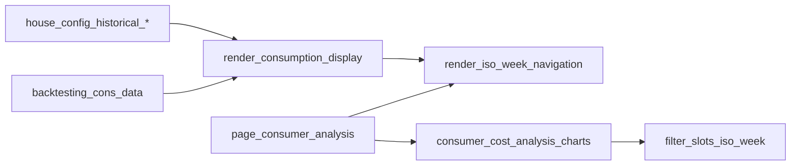
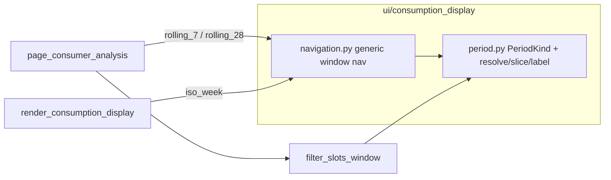

# Rolling period abstraction (Option C) — Analyse first

## Decisions locked in this plan

- **Architecture:** shared period API in `ui/consumption_display`; Analyse adopts rolling windows now; SE/HK keep ISO-week browsing through the same API (no UX change there yet).
- **Analyse window UX:** length selector **7 / 28 days** plus **← / →** that steps the window by its length over available log history (anchor = end of selected window; default = latest complete window ending at last log slot / `live_now`).
- **Analyse KPIs:** replace calendar KW / Monat / Jahr with **selected window (7d or 28d)** + **trailing 28 days** (when view is 7d) or **trailing 7 days** (when view is 28d) as secondary comparison is *not* used — keep it simple: **two tiles for the selected window energy/cost context is wrong**. Instead: **one primary metric for the selected window** and keep a **trailing-year (approx. last 365 days of log)** tile as the long horizon (backlog “maybe later 12 months” as KPI only, not a chart mode yet). Chart titles/labels use the selected rolling window only.
- **Out of scope:** Swimspa S-2 block; SE monthly EUR charts; changing SE/HK default away from ISO weeks; `version.py`.

## Current state (reuse)

Shared ISO-week nav already lives in [`ui/consumption_display/navigation.py`](ui/consumption_display/navigation.py). Analyse additionally filters/aggregates in [`ui/consumer_cost_analysis_data.py`](ui/consumer_cost_analysis_data.py) / [`ui/consumer_cost_analysis_charts.py`](ui/consumer_cost_analysis_charts.py).

## Target shape

### 1. Shared period module

Add [`ui/consumption_display/period.py`](ui/consumption_display/period.py):

- `PeriodKind`: `ROLLING_7`, `ROLLING_28`, `ISO_WEEK` (reserve `ROLLING_365` as enum/comment only — not wired in UI).
- `TimeWindow(start: datetime, end: datetime, kind: PeriodKind)`.
- `resolve_rolling_window(anchor_end: datetime, *, days: int) -> TimeWindow` — half-open or inclusive end matching existing slot semantics; document clearly (prefer: `[end - days, end]` using slot timestamps already in the series).
- `list_rolling_windows(timestamps, *, days: int, nav_bounds=...) -> list[TimeWindow]` — discrete step anchors from data (step = `days`), newest last; skip empty windows.
- `list_iso_week_windows(...)` — wrap existing `iso_weeks_in_timestamps` into `TimeWindow` list for SE/HK.
- `format_window_label(window) -> str` — e.g. `07.09.–14.09.2026 (7 Tage)` / keep `format_iso_week_label` for ISO.
- Index helpers: `indices_in_window(timestamps, window)`, used by bundle slicing.

Keep [`slice_bundle_for_iso_week`](ui/consumption_display/aggregation.py) as a thin wrapper calling `slice_bundle_for_window` so existing SE/HK call sites stay stable.

### 2. Generic navigation

Refactor [`ui/consumption_display/navigation.py`](ui/consumption_display/navigation.py):

- Add `render_period_navigation(timestamps, *, key_prefix, period_kind | kind from session, reset_token, nav_bounds) -> TimeWindow | None`.
- For rolling kinds: ←/→ over `list_rolling_windows`; label via `format_window_label`; optional jump by date (`TT.MM.JJJJ` → window containing that day) — replace KW jump text for rolling mode.
- For `ISO_WEEK`: preserve current behavior (including KW jump parsers) by delegating to existing helpers so SE/HK stay unchanged.
- `render_iso_week_navigation` becomes a thin wrapper around `render_period_navigation(..., kind=ISO_WEEK)` to avoid breaking imports (`consumption_comparison_panel`, panel, Analyse until cutover).

### 3. Analyse page + cost analysis

[`ui/pages/page_consumer_analysis.py`](ui/pages/page_consumer_analysis.py):

- Replace ISO-week bootstrap with: `st.radio` / segmented control **7 Tage | 28 Tage** (session key), then `render_period_navigation` with matching `PeriodKind`.
- Default selection: **latest** window (same intent as today’s “prefer latest ISO week”).
- Update help text: no “KW / Monat / Jahr”; describe rolling windows + trailing-year KPI.

[`ui/consumer_cost_analysis_data.py`](ui/consumer_cost_analysis_data.py):

- Add `filter_slots_window(slots, window: TimeWindow)`.
- Keep `filter_slots_iso_week` as wrapper or deprecate in tests only if still needed.
- Add `filter_slots_trailing_days(slots, *, end: datetime, days: int)` for the year KPI = 365 days from `now`/last slot.

[`ui/consumer_cost_analysis_charts.py`](ui/consumer_cost_analysis_charts.py):

- Rename/adapt `render_week_analysis` → `render_window_analysis(series, window, now)` (or keep name but take `TimeWindow`).
- Chart titles use `format_window_label`.
- `render_period_kpis`: **tile 1** = selected window cost/energy; **tile 2** = trailing **365 days** of available log (label makes partial coverage obvious via existing coverage caption). Drop calendar month/ISO-week KPI tiles.

### 4. SE / HK (no product change)

[`ui/consumption_display/panel.py`](ui/consumption_display/panel.py) continues calling ISO-week navigation (wrapper). No change to monthly stacked charts. Optional one-line comment that rolling kinds are Analyse-first.

### 5. Tests and docs

- Extend [`tests/test_consumption_display.py`](tests/test_consumption_display.py): rolling window list/resolve/label/slice; ISO wrapper still green.
- Update [`tests/test_consumer_cost_analysis.py`](tests/test_consumer_cost_analysis.py): window filter + KPI aggregation windows; drop ISO-week-only assumptions for Analyse path.
- User docs (German): short update in [`docs/ui/betriebsmodi.md`](docs/ui/betriebsmodi.md) and/or Analyse section in [`docs/user-manual/Benutzer-Handbuch-Earnie.md`](docs/user-manual/Benutzer-Handbuch-Earnie.md) — Wochen → letzte 7/28 Tage; keep identifiers verbatim.
- Backlog: after implementation (session end), move the 2.+1 bullet to Erledigt or narrow it to “SE/HK opt-in later” — only when user asks to close the session / archive; do not edit backlog in this implementation unless requested.

## Implementation order

1. `period.py` + aggregation `slice_bundle_for_window` + tests.
2. Navigation refactor (ISO wrapper + rolling nav) + tests.
3. Analyse data/charts/page + KPI change + tests.
4. German user-doc touch-up for Analyse wording.

## Acceptance

- Analyse: user can switch 7 vs 28 days; ←/→ moves by that length; charts/KPIs/battery panel follow the selected window; no KW jump UI on Analyse.
- SE/HK Verbrauchsdaten: still ISO-KW nav and week charts (regression-safe).
- Partial log coverage: captions still state data range; empty window shows a clear info message.
- No silent `version.py` bump.
