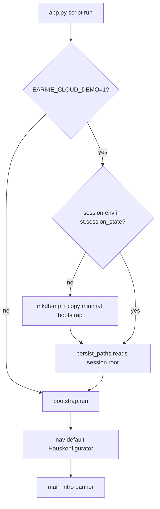

# SCC: Per-session empty Greenfield

## Goal

On Streamlit Community Cloud, **every new browser session** starts with an **empty** Greenfield config (minimal catalogs), lands on **Hauskonfigurator**, and shows a **brief instruction**. Visitors must not share or inherit another visitor’s saved house data.

## Defaults (fixed for this plan)

- Gate: `EARNIE_CLOUD_DEMO=1` in Streamlit secrets (with existing `EARNIE_OFFLINE=1`; keep `EARNIE_UI_MODES` as configured, typically `scenario_explorer`).
- Isolation: **per Streamlit session** temp workspace — **not** process-wide `os.environ` (unsafe under concurrency).
- Intro: **main-area** dismissible `st.info` once per session (German UI copy).
- Onboarding nav under cloud demo: Hauskonfigurator default; **do not** force Live-Konfiguration / Daemon pages (`force_echtzeit=False`). Szenario-Explorer unlocks later via existing readiness when `scenario_explorer` is in modes.
- Under cloud demo: **skip** [`offline_demo_seed`](runtime_store/offline_demo_seed.py) so empty catalogs stay empty until the user builds them.

## Implementation

### 1. Cloud demo detection + session workspace

Add [`runtime_store/cloud_demo.py`](runtime_store/cloud_demo.py) (or `ui/cloud_demo.py` if kept UI-only; prefer `runtime_store` so paths/bootstrap can call it):

- `is_cloud_demo() -> bool` via `EARNIE_CLOUD_DEMO=1` (`env_vars.is_truthy("CLOUD_DEMO")`).
- Session key e.g. `_earnie_cloud_env_root`.
- `ensure_cloud_session_env() -> str | None`:
  - No-op if not cloud demo.
  - If session root missing: `tempfile.mkdtemp(prefix="earnie_cloud_")`, create `config/` + `runtime/`, store absolute path in `st.session_state`.
  - Return the session root for the current script run.
- Do **not** set `EARNIE_ENV_PATH` globally.

### 2. Session-aware path resolution

In [`runtime_store/persist_paths.py`](runtime_store/persist_paths.py), lazy-read the session override (try `st.session_state`; ignore if Streamlit unavailable):

- Prefer session root over `EARNIE_ENV_PATH` / default `earnie_env` inside `env_root()` (and thus config/runtime defaults).
- Keep existing env overrides for local/Docker when cloud demo is off or no session key is set.
- Tests can set the override via a small test hook or by mocking session_state.

### 3. Wire `app.py` startup order

In [`app.py`](app.py), before `bootstrap.run()`:

1. Import Streamlit early enough that `st.session_state` works on script runs.
2. Call `ensure_cloud_session_env()`.
3. Then `bootstrap.run()` / `load_config_or_exit` / `reinit_config_or_exit` so they resolve into the session tree.

Adjust [`runtime_store/bootstrap.py`](runtime_store/bootstrap.py): if `is_cloud_demo()`, skip `seed_offline_live_scenario()`.

### 4. Always open Hauskonfigurator + cloud onboarding nav

In [`ui/navigation.py`](ui/navigation.py):

- When `is_cloud_demo()` and `is_setup_navigation_restricted()`, build restricted specs with `house_config_default=True` and **`force_echtzeit=False`** (today [`_restricted_page_specs`](ui/navigation.py) always forces Live/Daemon — wrong for offline SCC).
- After planning is ready, existing logic remains: SE appears if enabled; default page selection stays as today for unlocked nav (session already started on Hauskonfigurator while restricted).

### 5. Brief instruction banner

Add a small helper (e.g. in `runtime_store/cloud_demo.py` or `ui/cloud_demo_intro.py`) and call it from `main()` in [`app.py`](app.py) after CSS/notices, before `navigation.run()`:

- German short copy, e.g. welcome / empty start / configure house in Hauskonfigurator / then Szenarien / Szenario-Explorer; data only for this browser session.
- Dismiss via `st.session_state` flag (button or checkbox); do not show again in that session.
- Existing sidebar setup progress ([`ui/setup_progress.py`](ui/setup_progress.py)) stays; intro is the one-time overview.

### 6. Docs + SCC secrets checklist

Update German user docs briefly:

- [`docs/einrichtung/private-env.md`](docs/einrichtung/private-env.md) — Community Cloud: `EARNIE_CLOUD_DEMO=1` + per-session empty Greenfield.
- [`docs/einrichtung/betrieb.md`](docs/einrichtung/betrieb.md) — env table row for `EARNIE_CLOUD_DEMO`.

Operator note (not committed secrets): Streamlit Cloud app secrets should include `EARNIE_CLOUD_DEMO=1`, `EARNIE_OFFLINE=1`, and the desired `EARNIE_UI_MODES`.

### 7. Tests

- New `tests/test_cloud_demo.py` (or extend bootstrap tests):
  - With cloud demo + fake session_state: first call creates temp env; second call reuses it; `resolve_config_json_path()` points under that root; bootstrap creates minimal files; offline seed not applied.
  - Without cloud demo: no session root; normal `earnie_env` behavior.
  - Navigation: cloud + restricted → Hauskonfigurator is `default=True` and Live/Daemon pages absent.
- Keep tests Streamlit-light (mock `st.session_state` / avoid full AppTest unless already used).

### 8. Backlog

When implementing: mark *App on Streamlit cloud should start always with Greenfield* done in [`backlog/Backlog.md`](backlog/Backlog.md) / Erledigt per usual session rules.

## Out of scope

- Changing default SCC `EARNIE_UI_MODES` in code (secrets remain source of truth).
- Persistent shared demo house on SCC.
- Reliable cleanup of temp dirs on session end (OS/reboot cleans `/tmp`; optional best-effort later).
- `version.py` bump (ask separately if a release is desired).
