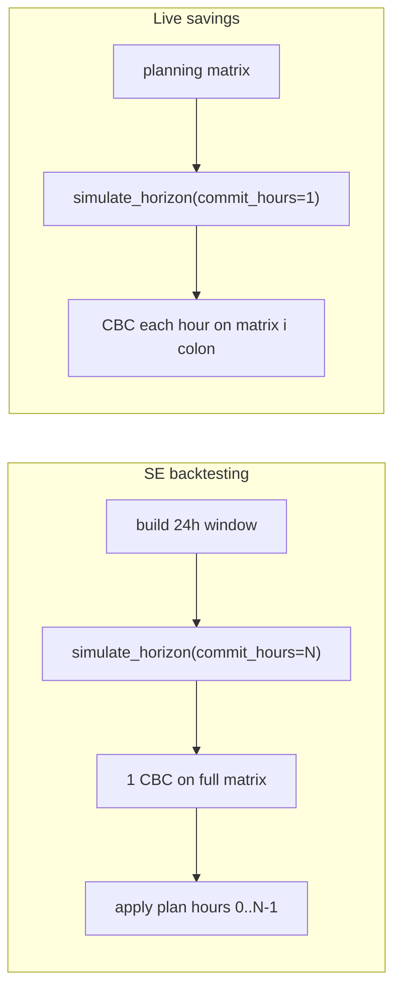

# 2.3.c.0a — SE commit-K / open-loop MILP

## Decisions (confirmed)

- **Policy:** `commit_hours` parameter on `simulate_horizon`. Re-solve CBC every K hours; apply the stored full-horizon plan for the committed hours.
- **SE default:** `commit_hours = len(matrix)` (typically 24) → one MILP per window (open-loop).
- **Live savings / default API:** `commit_hours=1` → today’s hourly rolling MPC (no silent forecast change).
- **Live control** (`main.py` → single `milp_optimizer`) unchanged.
- Spec [`docs/spec/planning-horizon-sunset.md`](docs/spec/planning-horizon-sunset.md): **read German as-is** (no translation unless you ask later).

## Hook points

| Layer | File | Change |
|-------|------|--------|
| Core loop | [`optimizer/simulation.py`](optimizer/simulation.py) | Add `commit_hours: int = 1`; re-solve when `i % commit_hours == 0` (or plan exhausted); else apply cached plan slot |
| Plan extract | [`optimizer/milp_result.py`](optimizer/milp_result.py) (+ thin helpers) | Extract **per-hour** `p_charge` / `p_discharge` / `p_grid_buy`, `e_batt`, consumer kW / pv_follow for all `t` (today `_extract_milp_plan` / `_consumer_powers_now` are t0-only) |
| Control derive | [`optimizer/battery.py`](optimizer/battery.py) | Generalize `_derive_control_from_milp` to hour index `t` (today hardcodes `matrix[0]` / `e_batt[0]`) |
| SE wiring | [`simulation/engine.py`](simulation/engine.py) | Pass `commit_hours=len(matrix)` (and same for optional `matrix_full` snapshot path) |
| CLI A/B | new small script under `scripts/` | Compare K=1 vs K=N on a known log slice for `fixed_24h` and `sunrise_window` |

Do **not** change `milp_optimizer` Live return contract for `main.py`; extraction for simulation can live beside existing t0 helpers (or an optional flag used only by the horizon simulator).

## Algorithm (inside `simulate_horizon`)

1. Validate `commit_hours >= 1` (informative error if invalid).
2. At hour `i`, if no active plan or commit block exhausted → `milp_optimizer(remaining_slice=matrix[i:], …)` once; extract schedule of length `len(remaining_slice)`; keep only the next `min(commit_hours, remaining)` slots as the commit buffer.
3. **Terminal SoC:** For `commit_hours == 1`, keep today’s rule (`terminal_soc_percent` only when `len(remaining_slice)==1`). For `commit_hours > 1`, pass `horizon_terminal_soc` on every re-solve that still includes the window end (so open-loop does not lose the end-SoC constraint that MPC only enforced on the final 1 h solve).
4. Apply one hour from the buffer: build chart row (same fields as `_simulate_single_hour_optimizer`), then existing `_cap_flex_delivery`, `update_generic_flex_run_state`, `finalize_chart_row_energy`.
5. Advance SoC with Huawei physics as today; on the next re-solve, pass updated `sim_soc` and remaining flex targets (perfect foresight on prices/PV/load; plant state still rolls).

Expected MILP count per 24 h SE window: **1** (open-loop) vs **24** (K=1).

## A/B

- Short fixture or known year-log slice (reuse existing backtesting helpers / logs under `earnie_env/runtime/` if present — do not invent new test-data generators).
- Metrics already available: € via `calculate_cost_euro_from_rows`, SoC via chart rows / `horizon_end_soc_from_chart_rows`, flex via `delivered_flex_kwh_from_rows`.
- Modes: both `fixed_24h` and `sunrise_window`.
- Report wall time + relative deltas; gate is “acceptable for SE trust,” not Live parity.

## Tests

- Unit: schedule extraction length / t0 equals current t0 helpers.
- Unit/integration: `commit_hours=1` matches current chart-row behavior on an existing small matrix fixture ([`tests/test_generic_flex_run.py`](tests/test_generic_flex_run.py), [`tests/test_backtesting_critical_integration.py`](tests/test_backtesting_critical_integration.py) patterns).
- Unit: `commit_hours=len(matrix)` → exactly one CBC solve (mock `milp_optimizer` or count via existing CBC event hooks).
- Keep Live savings call sites on default K=1 (no argument).

## Docs

- Update [`docs/spec/planning-horizon-sunset.md`](docs/spec/planning-horizon-sunset.md) §4.2: SE = perfect-foresight open-loop / commit-K; Live = periodic re-opt / MPC; note Huawei SoC apply can diverge from MILP `e_batt`.
- Short German note in [`docs/ui/betriebsmodi.md`](docs/ui/betriebsmodi.md) (SE section): Scenario Explorer is not Live re-opt parity.

## Out of scope

- `2.3.c.0b` HiGHS, `2.3.c.1` trivial fast paths, `2.3.c.2` terminal/weekend research.
- Changing Live actuator cadence or removing terminal SoC research.
- `version.py` bump (ask later if you want a release).
