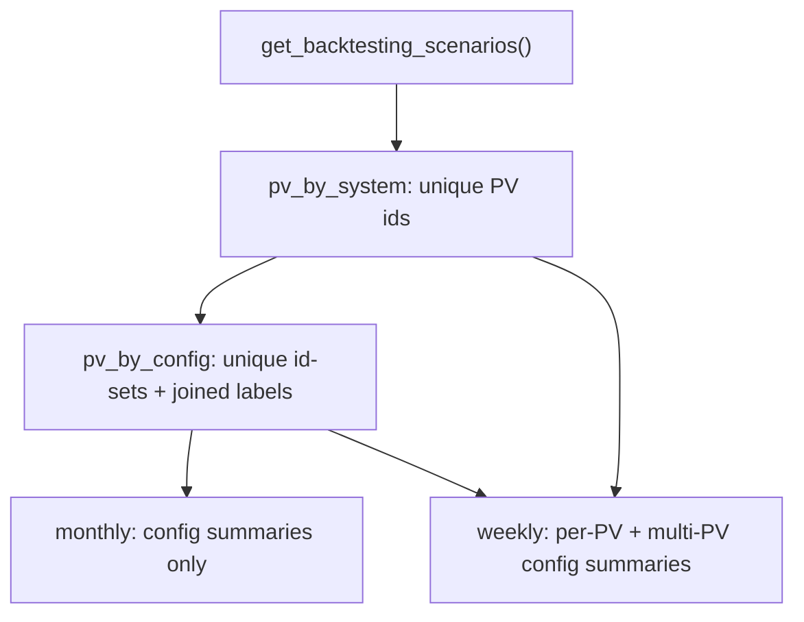

# SE Multi-Scenario PV Charts (revised)

Supersedes the chart semantics in `[.cursor/plans/se_multi-scenario_pv_charts_eecba15a.plan.md](.cursor/plans/se_multi-scenario_pv_charts_eecba15a.plan.md)`. Overlay wiring (`with_modeled_pv_from_all_scenarios`) stays; only **which series are drawn**, **legend names**, and **colors** change.

## Locked chart semantics (Verbrauchsdaten / CONS_DATA)

| Chart                   | Series                                                                                                               | Legend                                                        | Notes                                |
| ----------------------- | -------------------------------------------------------------------------------------------------------------------- | ------------------------------------------------------------- | ------------------------------------ |
| **Monatsverbrauch**     | One line per **unique PV configuration as sum** across scenarios                                                     | Joined PV labels, e.g. `"Dach Süd"`, `"Dach Nord + Dach Süd"` | **No** PV-Ist; **no** per-roof lines |
| **Stündlicher Verlauf** | (1) One line per **unique PV system** used in any scenario; (2) **plus** the same unique-config summaries as monthly | Per-PV: `"Dach Süd"`, `"Dach Nord"`; summaries: joined labels | **No** PV-Ist                        |

**Unique PV configuration** = unique frozenset of `pv_systems[].id` from a scenario’s `_planning_pv_systems` (dedupe across scenarios that share the same set). Example from `silent-migration-test`:

- `{dach_sued}` → `"Dach Süd"` (live + mit_10_kwh_speicher)
- `{dach_nord, dach_sued}` → `"Dach Nord + Dach Süd"` (mit_zweiter_pv_anlage)

**Summary series values** = hour-wise sum of the modeled kW of all PVs in that set.

**Joined label rule:** collect planning `label`s for the set, sort alphabetically (stable, order-independent), join with `" + "`.

**Weekly duplicate rule:** if a unique config has only one PV, its summary equals that PV’s individual series — **omit** the single-PV summary on the weekly chart so `"Dach Süd"` appears once. Multi-PV summaries (e.g. `"Dach Nord + Dach Süd"`) are always added.

**Colors:** all PV traces use a dedicated yellowish palette only (no `CONSUMER_PALETTE`). Define e.g. `PV_YELLOW_PALETTE` in `[ui/chart_colors.py](ui/chart_colors.py)` (amber/gold/mustard variants starting from existing `#f4c430`). Assign by series index.

## Implementation

### 1. Bundle fields + adapter

Extend `[ConsumptionSeriesBundle](ui/consumption_display/types.py)`:

- Keep `pv_by_system` / `pv_system_labels` (per unique PV id) — needed for weekly individuals and to build sums.
- Add `pv_by_config: dict[str, list[float]]` and `pv_config_labels: dict[str, str]` where keys are stable config keys (e.g. sorted ids joined by `+`: `"dach_nord+dach_sued"`).

In `[with_modeled_pv_from_all_scenarios](ui/consumption_display/adapters.py)`:

- Keep existing per-PV modeling into `pv_by_system`.
- Additionally: walk scenarios, collect unique frozensets of PV ids; for each set, sum the already-modeled per-system series into `pv_by_config` and set joined label.

Slice both maps in `[aggregation.slice_bundle_for_iso_week](ui/consumption_display/aggregation.py)` / `_slice_bundle`.

### 2. Charts — `[ui/consumption_display/charts.py](ui/consumption_display/charts.py)`

`**stacked_monthly_chart` (CONS_DATA path):**

- Prefer `pv_by_config`: one scatter per config (monthly kWh via `monthly_kwh_from_series`), name = `pv_config_labels[key]`, color from yellow palette.
- Do **not** plot per-system lines from `pv_by_system` on monthly.
- Remove the dashed `"PV Ist (cons_data)"` branch entirely when modeled overlays exist.
- Fallback (no overlays): keep single solid `"PV-Erzeugung"` from `bundle.pv` in yellow (unchanged fallback for non-multi overlay cases).

`**timeseries_chart` / week:**

- Plot each `pv_by_system` entry (solid, yellow palette, legend = PV label).
- Then plot each `pv_by_config` entry where the config has **≥ 2** PVs (summary; distinct yellow shade / slightly thicker or dashed so multi-PV totals read as summaries).
- Remove `"PV Ist (cons_data)"`.

### 3. Docs + tests

- Update `[docs/konfiguration/batterie-pv.md](docs/konfiguration/batterie-pv.md)`: monthly = unique config summaries (joined names); weekly = per-PV + multi-PV summaries; no PV-Ist; yellowish lines.
- Update `[tests/test_multi_scenario_pv_charts.py](tests/test_multi_scenario_pv_charts.py)`:
  - Unique configs → labels `"Dach Süd"` / `"Dach Nord + Dach Süd"` (use silent-migration-style fixtures).
  - Monthly legend has config names only; **no** `"PV Ist (cons_data)"`.
  - Weekly legend has individuals + multi-PV summary; **no** duplicate single-PV summary; **no** PV-Ist.
  - Assert PV line colors are from the yellow palette.

## Out of scope

- MILP / forecast.solar / schema.
- Per-PV columns in `cons_data_hourly.csv`.
- `version.py` bump (ask separately).
- Non–CONS_DATA chart modes beyond not regressing the single `"PV-Erzeugung"` fallback.

