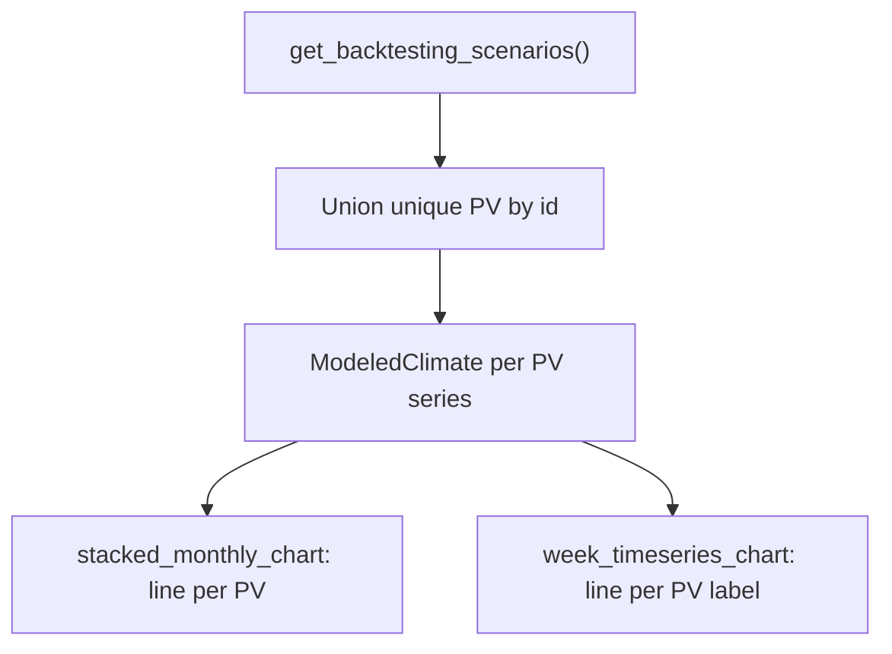

# SE Multi-Scenario PV Charts (follow-up)

Core Multi-PV work is done. This adapts chart behavior that today only uses **Live** via [`with_modeled_pv_by_system`](ui/consumption_display/adapters.py) + [`scenario_params_for_pv=config.get_resolved_runtime_settings()`](ui/backtesting_cons_data.py).

## Locked chart semantics

| Chart | Series | Legend | Source |
|-------|--------|--------|--------|
| **Monatsverbrauch: cons_data (kWh)** | One line per **unique PV setting** over all scenarios = monthly kWh of that PV’s modeled yield | PV `label` | Union of `_planning_pv_systems` across `config.get_backtesting_scenarios()` |
| **Stündlicher Verlauf** (ISO week) | One line per **unique PV setting** used in **any** scenario | PV `label` | Same union |

“Unique PV setting” = unique `pv_systems[].id` (dedupe across scenarios; first-seen planning params/label win).

Consumer stacked bars stay from `cons_data`. Historical `bundle.pv` (Loxone/synthetic sum) stays as a single dashed reference **"PV Ist (cons_data)"** when present—modeled per-PV lines are additional.

## Implementation

### 1. Collect + model overlay helper

Replace Live-only attach in [`ui/consumption_display/adapters.py`](ui/consumption_display/adapters.py):

- `collect_unique_planning_pv(scenarios) -> list[planning entry]` (dedupe by `id`, first-seen label/params).
- `with_modeled_pv_from_all_scenarios(bundle, scenarios: dict[str, dict])`:
  - Build the unique PV list across all scenarios.
  - For each unique PV id: pick one resolved scenario that includes it (prefer live id if present) for geo/climate context; compute that system’s hourly series into `pv_by_system` / `pv_system_labels` (label = planning `label`).
  - Always attach when ≥1 unique PV exists (drop the current `len(planning) < 2` gate).

Reuse existing [`ConsumptionSeriesBundle.pv_by_system`](ui/consumption_display/types.py) / `pv_system_labels` (no `pv_by_scenario` fields). Ensure `_slice_bundle` already slices `pv_by_system` (done).

### 2. Charts

[`stacked_monthly_chart`](ui/consumption_display/charts.py):

- If `pv_by_system`: for each PV id, aggregate hourly → monthly kWh (`monthly_kwh_from_series`); scatter line; name = PV label.
- Else keep single `PV-Erzeugung` from `bundle.pv`.
- If modeled overlays exist and `bundle.pv` is set: add dashed **"PV Ist (cons_data)"**.

[`week_timeseries_chart`](ui/consumption_display/charts.py):

- Prefer `pv_by_system`; legend name = **exactly** `pv_system_labels[id]` (no `PV ·` prefix).
- Same dashed Ist fallback when modeled overlays present.

### 3. Wire SE cons_data section

[`ui/backtesting_cons_data.py`](ui/backtesting_cons_data.py) + [`ui/consumption_display/panel.py`](ui/consumption_display/panel.py):

- Pass full `scenarios` (reuse [`try_get_backtesting_scenarios`](ui/backtesting.py)) instead of live-only `scenario_params_for_pv`.
- Call `with_modeled_pv_from_all_scenarios` inside panel for `CONS_DATA` mode.

### 4. Docs + tests

- Short note in [`docs/konfiguration/batterie-pv.md`](docs/konfiguration/batterie-pv.md): SE monthly and weekly both show one series per unique PV across all scenarios (legend = PV label).
- Tests: helper unions ids from two scenarios; monthly lines use PV labels not scenario labels; hourly legend uses PV labels; Live-only path no longer required for overlays.

## Out of scope

- Changing MILP / forecast.solar / schema (already done).
- Per-PV columns in `cons_data_hourly.csv`.
- `version.py` bump (ask separately).
